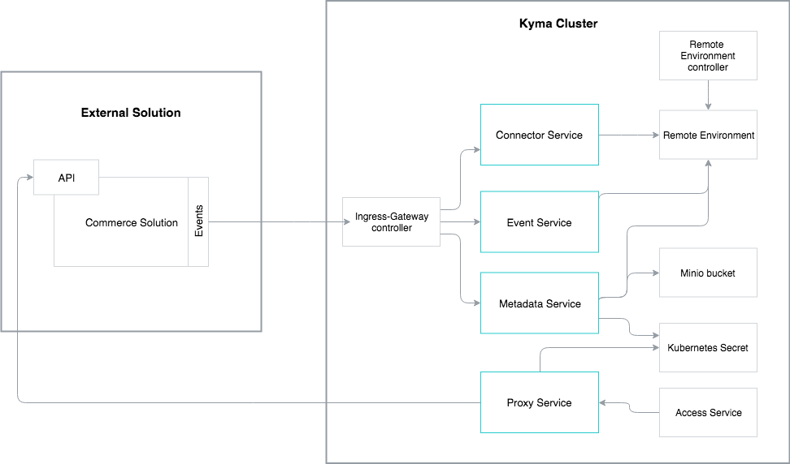

The Application Connector consists of the following components:

* **Ingress-Gateway controller** responsible for validating certificates and exposing multiple Application Connectors to the external world
* **Gateway** responsible for registering available services (APIs, Events) and proxying calls to the registered solution
* **Remote Environment CRD instance** responsible for storing a solution's metadata
* **Minio bucket** responsible for storing API specifications, Event Catalog, and documentation

To connect a new solution, you must deploy a new Application Connector. Every instance of the external solution connected to Kyma has only one instance of the Application Connector dedicated to it. See the **Deploying a new Application Connector** document to learn how to deploy a new Application Connector.

