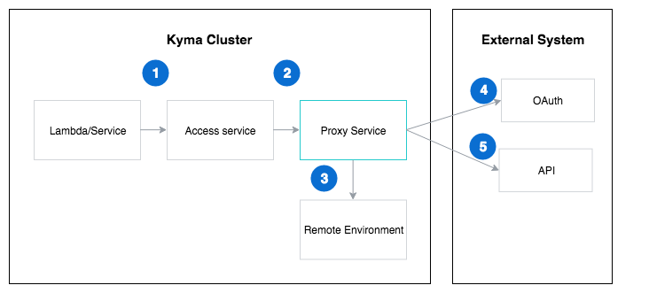

## Overview
Proxy Service is responsible for sending requests to external APIs registered with the [Metadata Service]().         
    

## Basic concepts 

The following diagram illustrates how Proxy Service interacts with Kyma components and external APIs secured with OAuth.
 

Lambdas and services call the access service which is created once registering API in [Metadata Service](TODO). 

Proxy Service is exposed via the access service and dispatches requests sent by lambdas or services deployed on Kyma. Access service's name is of the following form:
```
re-{remote-environment-name}-gateway-{service-id}
```
 
Proxy Service performs the following actions:
- analyzes Host header and extracts name of the remote environment and identifier of the service registered with Metadata Service
- looks up for API data (target API url, OAuth url) in the Remote Environment CRD
- obtains OAuth token  
- proxies call to the appropriate target url with token obtained in the previous step        

## Implementation Details
In order to assure optimal performance Proxy Service caches the following:
- OAuth tokens ; if token exists in the cache it will be used, otherwise it will be acquired
- ReverseProxy objects used for actual proxying requests to underlying url  


     