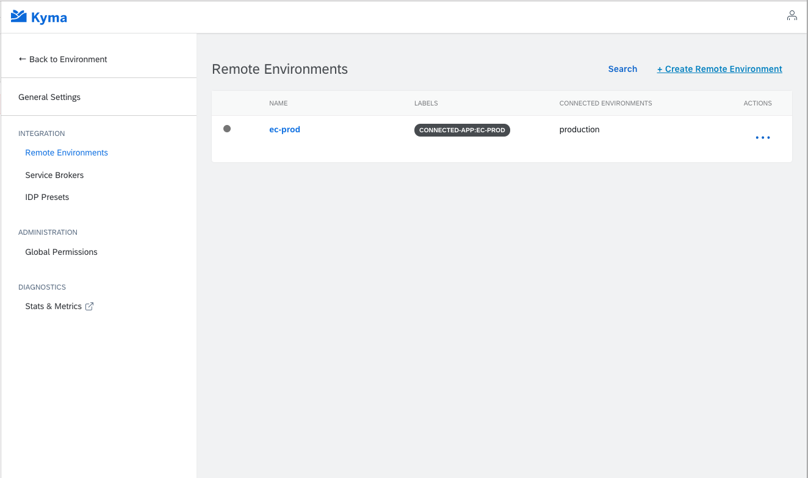
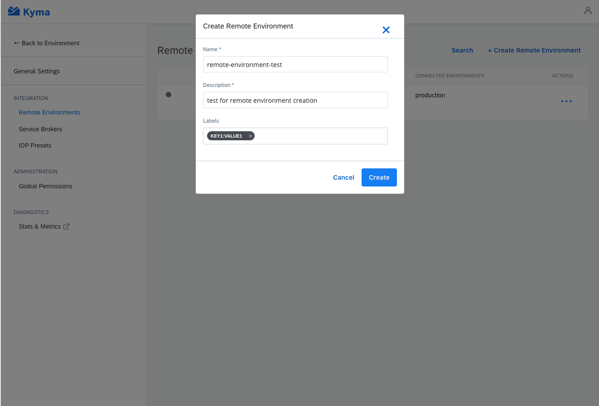

The Remote Environment controller is responsible for provisioning and de-provisioning of necessary deployments for created Remote Environments. 

The following operations are available:

- Create a new Remote Environment
- Delete the Remote Environment
- Update Remote Environment configuration

All operation can be done from within the `Console UI` or using `Kubectl` - command line tool.


All Remote Environments are installed in the `kyma-integration` Namespace.

>**NOTE:** A Remote Environment represents a single connected external solution.


## Install a Remote Environment

The Remote Environment can be removed from Kyma using either Console UI or Kubectl.

### Using the UI:

- Go to the Kyma console UI.
- Select Administration.
- Select the Remote Environments from the Integration section.
- Click Create Remote Environment.



- Provide the following details:
    - Name
    - Description
    - Labels of your choice which are key-value pairs
   


 - Click Create and the new Remote Environment will be created and you can check status in Remote Environment view.
 

### Using Kubectl

New Remote Environment can be created using the Kubectl apply command with the following yaml file:

re-production-1.yaml:

``` yaml
apiVersion: applicationconnector.kyma-project.io/v1alpha1
kind: RemoteEnvironment
metadata:
  name: production-1
spec:
  description: This Remote Environment for connecting production system 1.
  labels:
    region: us
    kind: production
```

Then you can execute the following command:

``` bash
kubectl apply -f ./re-production-1.yaml
```

## Delete a Remote Environment

The Remote Environment can be removed from Kyma using either Console UI or Kubectl.

### Using the UI:

- Go to the Kyma console UI.
- Select Administration.
- Select the Remote Environments from the Integration section.
- Choose the Remote Environment to which you want to delete.
- Click Delete.


 

### Using Kubectl

The Remote Environment can be deleted using the following command:

Then you can execute the following command:

```bash
kubectl delete re name-of-remote-environment
```

## Update Remote Environment

The Remote Environment can be updated using either Console UI or Kubectl.

>**NOTE:** The name of Remote Environment cannot be changed.

### Using the UI:

- Go to the Kyma console UI.
- Select Administration.
- Select the Remote Environments from the Integration section.
- Choose the Remote Environment to which you want to update.
- Change the description and labels
- Click Save.

### Using Kubectl

Update the file: `re-production-1.yaml`

``` yaml
apiVersion: applicationconnector.kyma-project.io/v1alpha1
kind: RemoteEnvironment
metadata:
  name: production-1
spec:
  description: This is new description.
  labels:
    region: new-region
    kind: production
```

Then you can execute the following command:

``` bash
kubectl apply -f ./re-production-1.yaml
```

## How to check if your remote environment was successfully created.

The new Remote Environment will appear on the Remote Environment lists and will have status `Serving.`
