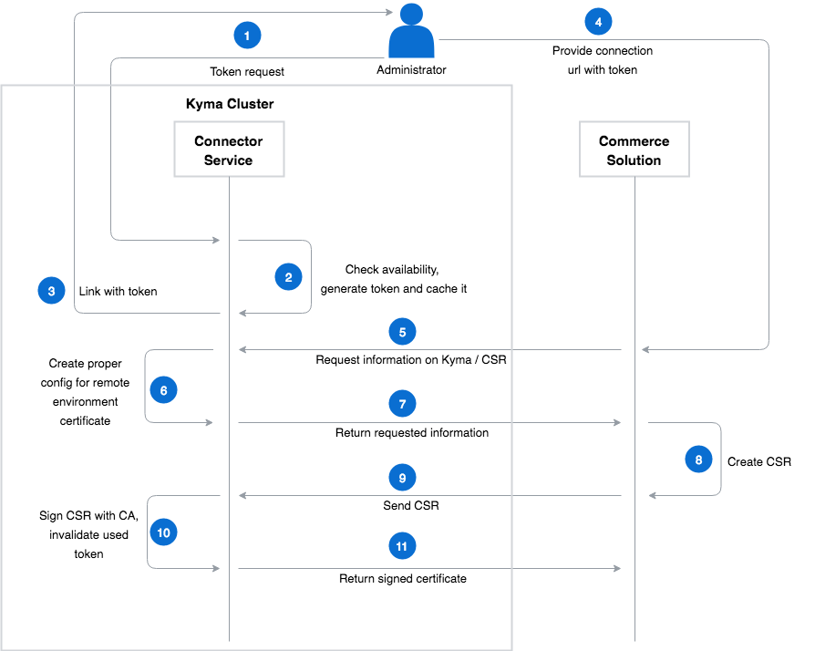

## Overview

Kyma Application Connector allows to authenticate and securely communicate with different systems. Kyma provides an easy way to set up these external solutions with the mechanism for automatic connection configuration.

## Flow description

Automatic configuration flow is presented in following diagram:


This example assumes that the new Remote Environment already exists and it is in the `disconnected` state, which means that there are no solutions connected to it.

On the diagram, Admin on the Kyma side and on external system side is the same person.

1. The admin requests for a token using the CLI or the UI and receives a link with the token, which is valid for a limited period of time.
2. The admin passes the token to the external system, which requests for information regarding the Kyma installation. In the response, it receives the following information:
    - the URL to which a third-party solution sends its Certificate Signing Request (CSR)
    - URLs of the available APIs
    - information required to generate a CSR
3. The external system generates a CSR based on the information provided by Kyma and sends the CSR to the designated URL. In the response, the external system receives a signed certificate. It can use the certificate to authenticate and safely communicate with Kyma.

## Configuration steps

Follow these steps to configure the automatic connection between the Kyma's Application Connector and an external system:

1. Request a token through the terminal.
    >**NOTE:** Alternatively, use the UI to request it.

    There is no direct way to request the token from command line. You can do it using `kubectl port-forward` or `kubectl proxy`.

    - Request:

    In the first terminal run:
    ```
    kubectl -n=kyma-integration port-forward svc/connector-service-internal-api 8080:8080
    ```
    And send the request in the second one.
    ```
    curl -X POST http://localhost:8080/v1/remoteenvironments/{remote-environment-name}/tokens
    ```
    - Response:
    ```json
    {
        "url":"https://connector-service.CLUSTER_NAME.kyma.cluster.cx/v1/remoteenvironments/{remote-environment-name}/info?token=example-token-123",
        "token":"example-token-123"
    }
    ```

2. Use the provided link to fetch information about the Kyma's URLs and CSR configuration.
    - Request:
    ```
    curl https://connector-service.CLUSTER_NAME.kyma.cluster.cx/v1/remoteenvironments/{remote-environment-name}/info?token=example-token-123
    ```
    - Response:
    ```json
    {
        "csrUrl": "https://connector-service.CLUSTER_NAME.kyma.cluster.cx/v1/remoteenvironments/{remote-environment-name}/client-certs?token=example-token-456",
        "api":{
            "metadataUrl":      "https://gateway.CLUSTER_NAME.kyma.cluster.cx/{remote-environment-name}/v1/metadata/services",
            "eventsUrl":        "https://gateway.CLUSTER_NAME.kyma.cluster.cx/{remote-environment-name}/v1/events",
            "certificatesUrl":  "https://connector-service.CLUSTER_NAME.kyma.cluster.cx/v1/remoteenvironments/{remote-environment-name}",
        },
        "certificate":{
            "subject":"OU=Test,O=Test,L=Blacksburg,ST=Virginia,C=US,CN=ec-default",
            "extensions": "",
            "key-algorithm": "rsa2048",
        }
    }
    ```

3. Use values received in the `certificate.subject` field to create a CSR. After the CSR is ready, make the following call:
    - Request:
    ```
    curl -H "Content-Type: application/json" -d '{"csr":"BASE64_ENCODED_CSR_HERE"}' https://connector-service.CLUSTER_NAME.kyma.cluster.cx/v1/remoteenvironments/{remote-environment-name}/client-certs?token=example-token-456
    ```
    - Response:
    ```json
    {
        "crt":"BASE64_ENCODED_CRT"
    }
    ```

    Use the following command to generate the example CSR:
    ```
    openssl req -new -out test.csr -key hmc-default.key -subj "/OU=OrgUnit/O=Organization/L=Waldorf/ST=Waldorf/C=DE/CN=ec-default"
    ```

4. The `crt` field contains a valid base64-encoded PEM block of a certificate signed by the Kyma's CA.

5. The external system can now use the created certificate to securely authenticate and communicate with Kyma's Application Connector.
