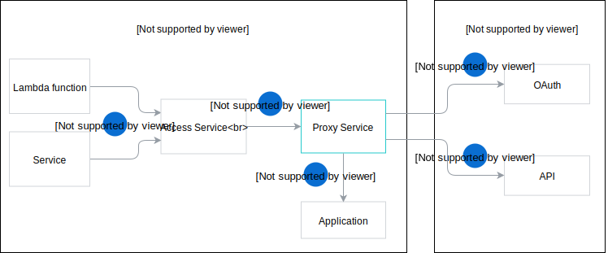

The Proxy Service sends the requests from Lambda functions and services in Kyma to external APIs registered with the Metadata Service. The Proxy Service works in conjunction with the Access Service, which exposes the Proxy Service.

>**NOTE:** The system creates an Access Service for every external API registered by the Metadata Service.

The following diagram illustrates how the Proxy Service interacts with other components and external APIs secured with OAuth.

1. A Lambda function calls the Access Service. The name of every Access Service follows this format: `re-{remote-environment-name}-{service-id}`
2. The Access Service exposes the Proxy Service.
3. The Proxy Service extracts the Remote Environment (RE) name and the service ID from the name of the Access Service name. Using the extracted RE name, the Proxy Service finds the respective RemoteEnvironment Custom Resource and obtains the information about the registered external API, such as the API URL and the OAuth server URL.
4. The Proxy Service gets a token from the OAuth server.
5. The Proxy Service calls the target API using the OAuth token.  

## Caching

To ensure optimal performance, the Proxy Service caches the OAuth tokens it obtains. If the service doesn't find a token valid for the call it makes, it gets a new token from the OAuth server.
Additionally, the service caches ReverseProxy objects used to proxy the requests to the underlying URL.
