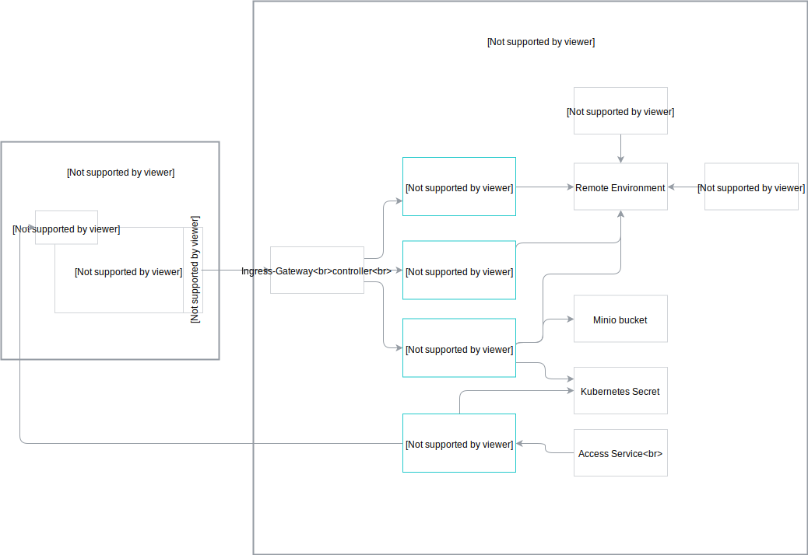

## Nginx Ingress Controller

The Nginx Ingress Controller exposes the Application Connector by assigning a public IP address and a DNS name to it.
The DNS name of the Ingress is cluster-dependant and follows the `gateway.{cluster-dns}` format, for example `gateway.servicemanager.cluster.kyma.cx`.
You can access every exposed Application (App) through its Gateway by using the assigned path. For example, to reach the Gateway for the `user-custom` App, use this URL: `gateway.servicemanager.cluster.kyma.cx/user-custom`. The Nginx Ingress Controller secures the endpoint with certificate validation. Each call must include a valid client certificate which is App-specific.

## Connector Service

The Connector Service:
- Handles the exchange of client certificates for a given RE.
- Provides the Application Registry and Event Service endpoints.
- Signs client certificates using the server side certificate stored in Kubernetes Secrets.

## Application Registry

The Application Registry stores all registered APIs and Event Catalog exposed by a connected external solution. The APIs and Event catalogs metadata are stored in the [Application](#custom-resource-application) custom resource.
The system creates a new Kubernetes service for each registered API. Additionally, a new Service Classes is registered in the Service Catalog.

>**NOTE:** Using the Application Registry, you can register an API along with its OAuth or Basic Authentication credentials. The credentials are stored in a Kubernetes Secret.

## Event Service

The Event Service sends Events to the Kyma Event Bus and enriches the Events with metadata that indicates the source of the Event.
This allows routing the Events to lambda functions and services based on their source App.

## Application

An App represents an external solution connected to Kyma. It handles the integration with other components, such as the Service Catalog or the Event Bus.
Using the components of the Application Connector, the App creates a coherent identity for a connected external solution and ensures its separation.
All Apps are created through the Application custom resource, which also stores all of the relevant metadata. You can map an App to many Kyma Namespaces and use the APIs and the Event Catalogs of the connected external solution within their context.

## Application Operator

The operator listens for creating or deleting the Application custom resources and acts accordingly, either provisioning or de-provisioning an instance of Application Proxy and Event Service for every custom resource.         

>**NOTE:** Every Application custom resource corresponds to a single App to which you can connect an external solution.

## Application Proxy

The Application Proxy is an intermediary component between a lambda function or a service and an external API registered with the Application Registry. It can call services secured with the [Basic Authentication](https://tools.ietf.org/html/rfc7617) mechanism, acquire OAuth tokens, and call OAuth-secured APIs.  

## Access Service

The Access Service exposes the Application Proxy and manages the access from the Lambda functions and services deployed in Kyma to the external APIs over the Application Proxy.

## Minio bucket

The Minio bucket stores the documentation of the connected external solution's registered APIs and Event catalogs.

## Kubernetes Secret

The Kubernetes Secret is a Kubernetes object which stores sensitive data, such as the OAuth credentials.
