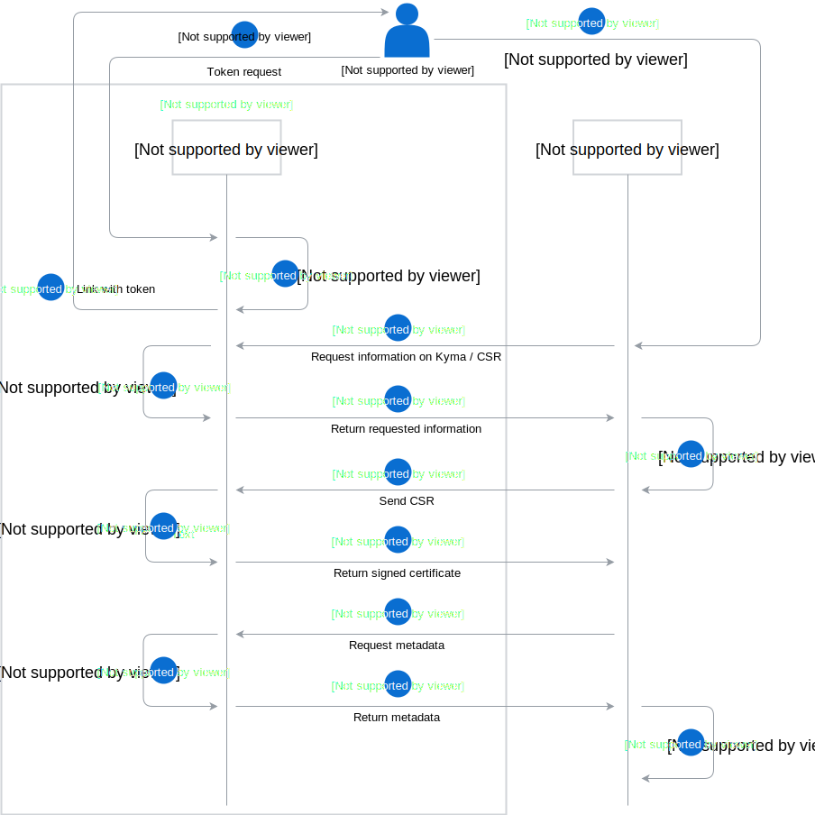

The Connector Service generates client certificates which secure the communication between Kyma and the connected external solutions.        

Generating a new client certificate is the first step in the process of configuring an Application (App). Kyma stores the root certificate and serves as the Certificate Authority when you configure a new App. When you generate a new client certificate, the Connector Service returns it along with the root certificate to allow validation.  

This diagram illustrates the client certificate generation flow in details:

1. The administrator requests for a token using the CLI or the UI and receives a link with the token, which is valid for a limited period of time.
2. The administrator passes the token to the external system, which requests for information regarding the Kyma installation. In the response, it receives the following information:
    - the URL to which a third-party solution sends its Certificate Signing Request (CSR)
    - URLs of the available APIs
    - information required to generate a CSR
3. The external system generates a CSR based on the information provided by Kyma and sends the CSR to the designated URL. In the response, the external system receives a signed certificate. It can use the certificate to authenticate and safely communicate with Kyma.
