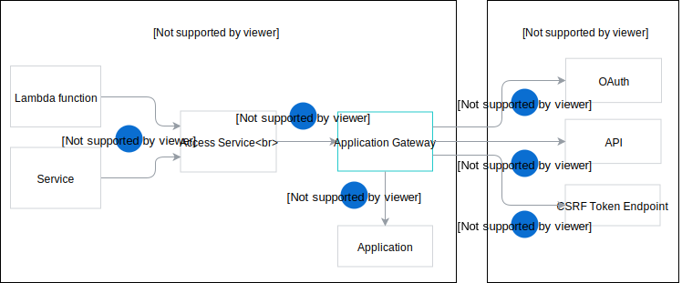

The Application Gateway sends the requests from Lambda functions and services in Kyma to external APIs registered with the Application Registry. The Application Gateway works in conjunction with the Access Service, which exposes the Application Gateway.

>**NOTE:** The system creates an Access Service for every external API registered by the Application Registry.

The following diagram illustrates how the Application Gateway interacts with other components and external APIs secured with OAuth.

1. A lambda function calls the Access Service. The name of every Access Service follows this format: `app-{application-name}-{service-id}`
2. The Access Service exposes the Application Gateway.
3. The Application Gateway extracts the Application name and the service ID from the name of the Access Service name. Using the extracted Application name, the Application Gateway finds the respective Application custom resource and obtains the information about the registered external API, such as the API URL and the OAuth server URL.
4. The Application Gateway gets a token from the OAuth server.
5. The Application Gateway calls the target API using the OAuth token.  

## Caching

To ensure optimal performance, the Application Gateway caches the OAuth tokens it obtains. If the service doesn't find a token valid for the call it makes, it gets a new token from the OAuth server.
Additionally, the service caches ReverseProxy objects used to proxy the requests to the underlying URL.