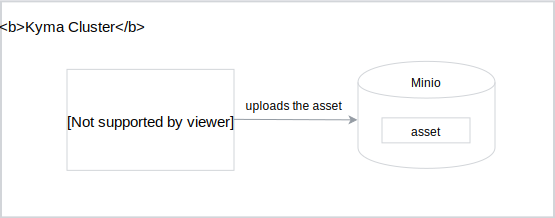
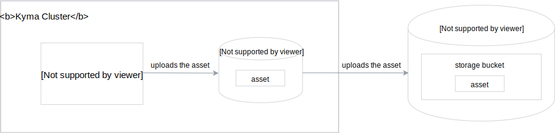

The whole concept of the Asset Store relies on MinIO as the storage solution. It supports Kyma's manifesto and the "batteries included" rule by providing you with this on-premise solution by default.

Depending on the usage scenario, you can:
- Use MinIO for local development.
- Store your assets on a production scale using MinIO in a [Gateway mode](https://github.com/minio/minio/tree/master/docs/gateway).

The Asset Store ensures that both usage scenarios work for Kyma, without additional configuration of the built-in controllers.


## Development mode storage

MinIO is an open-source asset storage server with Amazon S3 compatible API. You can use it to store various types of assets, such as documents, files, or images.

In the context of the Asset Store, the Asset Controller stores all assets in MinIO, in a dedicated storage space.



### Access MinIO credentials

For security reasons, MinIO credentials are generated during Kyma installation and stored inside the Kubernetes Secret object.

- To get the access key, run:
  ```bash
  kubectl get secret assetstore-minio -n kyma-system -o jsonpath="{.data.accesskey}" | base64 -D
  ```
- To get the secret key, run:
  ```bash
  kubectl get secret assetstore-minio -n kyma-system -o jsonpath="{.data.secretkey}" | base64 -D
  ```

You can also set MinIO credentials directly using `values.yaml` files. For more details, see the official [MinIO documentation](https://github.com/helm/charts/tree/master/stable/minio#configuration).


## Production storage

For the production purposes, the Asset Store uses MinIO Gateway which:

- Is a multi-cloud solution that offers the flexibility to choose a given cloud provider for the specific Kyma installation, including Azure, Amazon, and Google
- Allows you to use various cloud providers that support the data replication and CDN configuration
- Is compatible with Amazon S3 APIs




See [this tutorial](#tutorials-set-minio-to-the-google-cloud-storage-gateway-mode) to learn how to set MinIO to the Google Cloud Storage Gateway mode.
