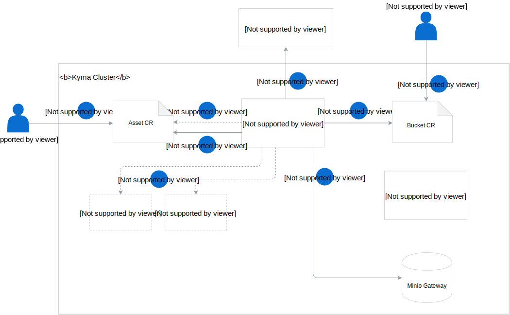

## Resources

The whole concept of the Asset Store relies on the following components:

- **Asset custom resource** (CR) is an obligatory [CR](#custom-resource-asset) in which you define the asset you want to store in a given storage bucket. Its definition requires the asset name and mode, the name of the Namespace in which it is available, the address of its web location, and the name of the bucket in which you want to store it. Optionally, you can specify the validation and mutation requirements that the asset must meet before it is stored.

- **Asset Controller** (AC) manages the [Asset CR lifecycle](#details-asset-custom-resource-lifecycle).

- **Bucket CR** is an obligatory [CR](#custom-resource-bucket) in which you define the name of the bucket for storing assets.

- **Bucket Controller** manages the [Bucket CR lifecycle](#details-bucket-custom-resource-lifecycle).

- **Validation Service** is an optional service which ensures that the asset meets the validation requirements specified in the Asset CR before uploading it to the bucket. The service returns the validation status to the AC.

- **Mutation Service** is an optional service which ensures that the asset is modified according to the mutation specification defined in the Asset CR before it is uploaded to the bucket. The service returns the modified asset to the AC.

- **Minio Gateway** is a Minio cluster mode which is a production-scalable storage solution. It ensures flexibility of using asset storage services from major cloud providers, including Azure Blob Storage, Amazon S3, and Google Cloud Storage.

## Asset flow

This diagram provides an overview of the basic Asset Store workflow and the role of particular components in this process:

1. Create a bucket through a Bucket CR.
2. Create an Asset CR in which you specify the reference to the asset source location and the name of the bucket in which you want to store it.
3. The AC listens for new Events and acts upon receiving the Asset CR creation Event.
4. The AC reads the CR definition and checks if the bucket is available.
5. If it is available, the AC fetches the asset from the source location provided in the CR. If the asset is a ZIP or TAR file, the AC unpacks the asset before uploading it into the bucket.
6. Optionally, the AC validates or modifies the asset if such a requirement is defined in the Asset CR. The AC communicates with the validation and mutation services and validates or modifies the asset according to the specification defined in the Asset CR.
7. The AC uploads the asset to Minio Gateway, into the bucket specified in the Asset CR.
8. The AC updates the status of the Asset CR with the information on the storage location of the file in the bucket.
