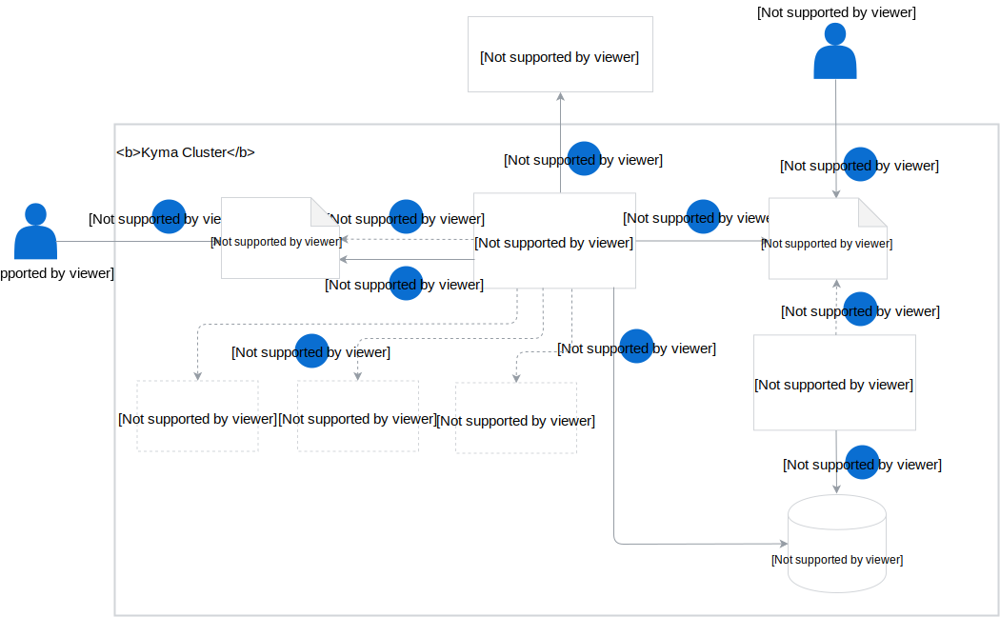

## Resources

The whole concept of the Asset Store relies on these elements:

- **Asset custom resource** that is an obligatory [custom resource](./06-01-asset.md) (CR) in which you define the asset you want to store in a given storage bucket. Its definition requires the asset name and mode, the name of the Namespace in which it is available, the address to its Internet location, and the name of the bucket in which you want to store it. Optionally, you can specify the validation and mutation operations that the asset must undergo before it is stored.

- **Asset Controller** that validates if the bucket specified in the Asset CR exists, fetches the asset based on the information provided in the Asset CR, unpacks it if necessary, and performs optional asset validation and mutation. It finally uploads the asset into the specified Minio (Gateway) bucket.

- **Bucket custom resource** that is an obligatory [custom resource](./06-02-bucket.md) in which you define the name of the bucket for storing assets.

- **Bucket Controller** listens to the events from the Bucket CR and checks if any new bucket was created or an existing one was deleted. It later uploads the new bucket onto Minio (Gateway) or deletes the bucket from it.

- **Validation Service** that is an optional service which a user can create to ensure that the asset meets the validation requirements specified in the Asset CR before it is uploaded to the bucket. The service returns the validation status to the Asset Controller.

- **Mutation Service** that is an optional service which a user can create to ensure that the asset is modified according to the mutation specification defined in the Asset CR before it is uploaded to the bucket. The service returns the modified asset to the Asset Controller.

- **Minio Gateway** - it is a Minio cluster mode which is a production-scalable storage solution. It ensure flexibility of using asset storage from major cloud providers, including Azure Blob Storage, Amazon S3, and Google Cloud Storage.

## Asset flow

This diagram provides an overview of the basic Asset Store workflow and the role of particular resources in this process:

1. Create a bucket through a Bucket custom resource (CR).
2. Create an Asset CR in which you specify the reference to the asset source location and the name of the bucket in which you want to store it.
3. The Asset Controller (AC) receives the event on the Asset CR creation.
4. The AC reads the CR definition and checks if the bucket is available.
5. If it is available, the Asset Controller fetches the asset from the source location provided in the CR. If the asset is a zip or tar file, the AC unpacks the asset before uploading it onto the bucket.
6. Optionally, the Asset Controller validates or modifies the asset if such a requirement is defined in the Asset CR. The AC communicates with the validation and mutation services and validates or modifies the asset according to the specification defined in the Asset CR.
7. The AC uploads the asset to Minio Gateway to the bucket specified in the Asset CR.
8. The AC updates the status of the Asset CR with the information on the storage location of the file in the bucket.
