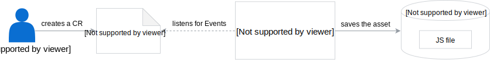
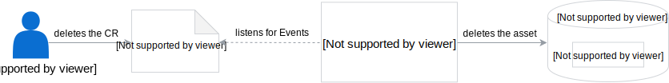

Learn about the lifecycle of the Asset custom resource (CR) and how its creation, removal, or a change in the bucket reference affects other Asset Store components.

## Create an Asset CR

When you create an Asset CR, the Asset Controller (AC) receives a CR creation Event, reads the CR definition, verifies if the bucket exists, downloads the asset, unpacks it, and stores it in Minio Gateway.

## Remove an Asset CR

When you remove the Asset CR, the AC receives a CR deletion Event and deletes the CR from Minio Gateway.

## Change the bucket reference

When you modify an Asset CR by updating the bucket reference in the Asset CR to a new one while the previous bucket still exists, the lifecycle starts again. The asset is created in a new storage location and this location is updated in the Asset CR.

Unfortunately, this causes duplication of data as the assets from the previous bucket storage are not cleaned up by default. Thus, to avoid multiplication of assets, first remove one Bucket CR and then modify the existing Asset CR with a new bucket reference.

## Other changes

The AC does not act upon changes in the Asset CR other than the change of the bucket reference. Thus, if the location of the source files or the mode of the files changes, you need to remove the existing Asset CD and create a new one with the correct details.
