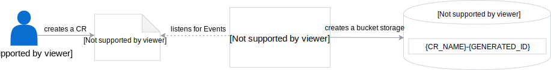
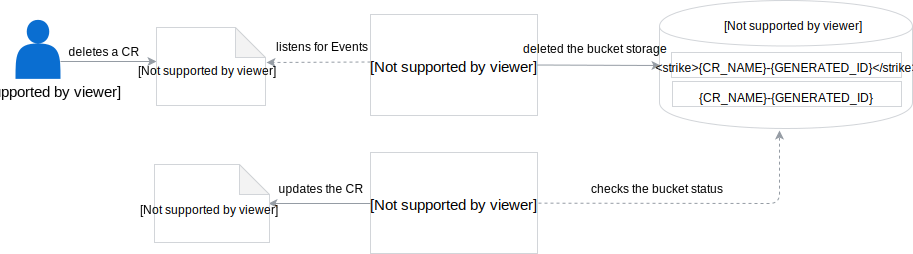

Learn about the lifecycle of the Bucket custom resource (CR) and how its creation and removal affect other Asset Store components.

## Create a Bucket CR

When you create a Bucket CR, the Bucket Controller (BC) receives a CR creation Event and creates a bucket with the name specified in the CR. It is created in the Minio Gateway storage under the `ns-{NAMESPACE_NAME}-{CR_NAME}` location. The status of the CR contains a reference URL to the created bucket.

## Remove a Bucket CR

When you remove the Bucket CR, the BC receives a CR deletion Event and removes the bucket with the whole content from Minio Gateway.

The Asset Controller (AC) also monitors the status of the referenced bucket. The AC checks the Bucket CR status to make sure the bucket exists. If the bucket is deleted, the AC receives information that the files are no longer accessible and the bucket was removed. The AC updates the status of the Asset CR to `ready: False` and the asset storage reference is removed. The Asset CR is not removed and you can use it later for a new bucket.

