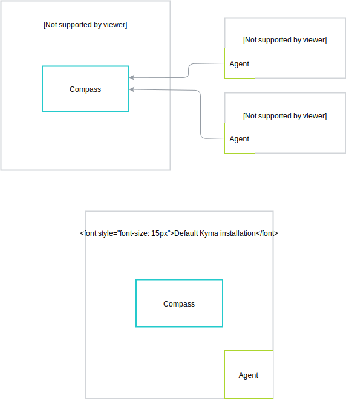

>**NOTE:** Compass is a new, experimental component in Kyma. To enable it, follow the instructions for the [custom component installation](/root/kyma#configuration-custom-component-installation) and enable the `compass` and `compass-runtime-agent` modules.

Compass (also known as Management Plane Services) is a multi-tenant system which consists of components that provide a way to register, group, and manage your applications across multiple Kyma runtimes. Using Compass, you can control and monitor your application landscape in one central place.

Compass allows for registering different types of applications and runtimes.
These are the types of possible integration levels between an application and Compass:
- Basic integration - administrator manually provides API/Events Metadata to Compass. This type of integration is used mainly for simple use-case scenarios and doesn't support all features.
- Built-in integration - integration with Compass is built-in inside the application.
- Proxy - a highly application-specific proxy component provides the integration.
- Central service -  a central service provides integration for a class of applications. It manages multiple instances of these applications. You can integrate multiple central services to support different types of applications.

You can register any runtime, providing that it fulfills a contract with Compass and implements its flow. First, your runtime must get a trusted connection to Compass. It must also allow for fetching application definitions and using these applications in a given tenant. The example runtimes are Kyma (Kubernetes), CloudFoundry, Serverless, etc.

Compass, as a part of Kyma, uses a set of Kyma features, such as Istio, Prometheus, Monitoring, or Tracing. It also contains Compass UI Cockpit that exposes Compass APIs to users.

## Compass in Kyma

You can run Kyma with Compass in three different ways:
- Default Kyma installation
- Kyma as a central Management Plane which allows you to manage your multiple (Kyma) runtimes.
- Kyma as a runtime

For more details, read the [architecture](#architecture-architecture) documents. 
