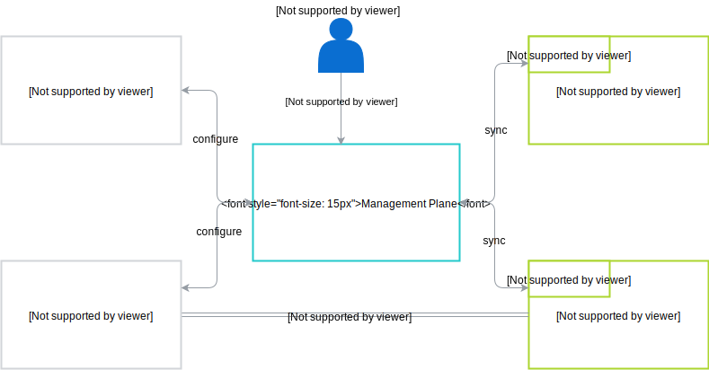
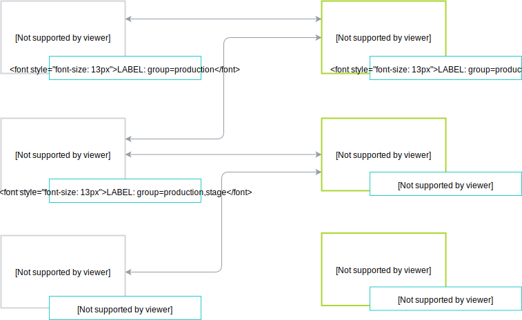

Management Plane is a central place which stores configuration about Applications and Runtimes and is responsible for propagating that information to Applications and Runtimes.
Management Plane plays crucial role in establishing trusted connection between Applications and Runtimes.

An administrator adds Runtimes, Applications and configures them through Management Plane GraphQL API.
To keep Runtimes in-sync with the configuration, [an agent](./../terminology.md#runtime-agent) installed on a Runtime is responsible for fetching actual configuration.
An Agent sends information about Runtime health checks to Management Plane.
In case an Application has configured optional [Webhooks](./../terminology.md#application-webhook-api), Management Plane notifies an Application about any events that concern given Application.
Management Plane does not participate in any business flow. After establishing a trusted connection between Application
and Runtime, they communicate directly, with omitting Management Plane.

## Grouping
In order to connect Applications and Runtimes, assign it to the same Group.
A Group is a simple label with the key `group`. If Application or Runtime is not explicitly assigned to any Group, it belongs to the `default` Group.
If you add a Group to the Application or Runtime assigned to the `default` group, it is automatically removed from the `default` group and moved to the new one.

Application or Runtime can be assigned to many groups. On the diagram above, you can see that `Application 2` belongs to 2 Groups: `production` and `stage`.
Thanks to that, its API or Events can be consumed by both `Runtime 1` and `Runtime 2`. Communication between components that do not belong to the same group is forbidden,
in the example above, `Application 3` cannot communicate with `Runtime 1`.
