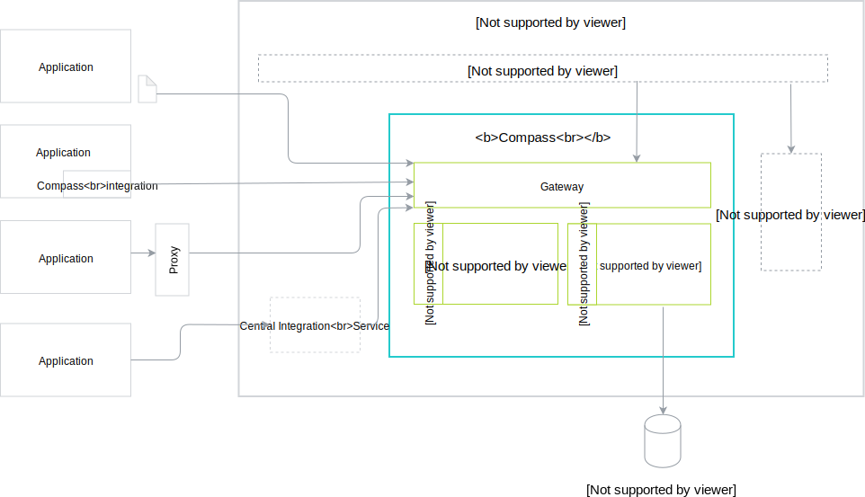

## Application

Application represents any external system that you want to register to Compass with its API and Event definitions. These are the types of possible integration levels between an Application and Compass:
- Manual integration - the Administrator manually provides API or Events metadata to Compass. Use this type of integration for simple use-case scenarios as it does not support all features.
- Built-in integration - integration with Compass is built in the Application.
- Proxy - a highly Application-specific proxy component provides the integration.
- Integration System -  a central service provides integration for the dedicated group of Applications across multiple tenants. It manages multiple instances of the given Application type. You can integrate multiple Integration Systems to support different types of Applications.

## Kyma Runtime

Runtime is a system to which you can apply configuration provided by Compass. Your Runtime must get a trusted connection to Compass. It must also allow for fetching Application definitions and using these Applications in one-tenant scope. By default, Compass is integrated with Kyma (Kubernetes), but its usage can also be extended to other platforms, such as CloudFoundry or Serverless.

## Runtime Agent

Runtime Agent is an integral part of every Runtime and it fetches the latest configuration from Compass. In the future releases, Runtime Agent will:
- Provide Runtime specific information that will be displayed in the Compass UI, such as Runtime UI URL
- Provide Compass with Runtime configuration, such as Event Gateway URL, that should be passed to an Application
- Send Runtime health checks to Compass

## Cockpit

Cockpit is a UI that calls Compass APIs. This component is interchangeable.

## Gateway

Gateway proxies the tenant's incoming requests to the Director component. All communication, whether it comes from an Application or other external components, flows through Gateway.

## Connector

Connector establishes trust between Applications and Runtimes. Currently, only client certificates are supported.

## Director

Director handles the process of managing Applications and Runtimes. It also requests Application webhook APIs for credentials and exposes health information about Runtimes. This component has access to the storage.

## Runtime Provisioner

Runtime Provisioner handles the creation, modification, and deletion of Runtimes. This component is interchangeable.
