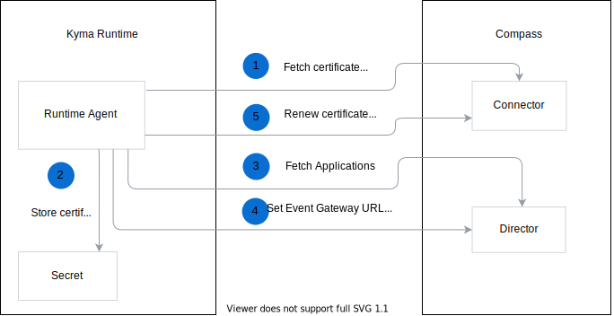

This document presents the workflow of Runtime Agent. 

1. Runtime Agent fetches the certificate from the Connector to initialize connection with Compass.

2. Runtime Agent stores the certificate and key for the Connector and the Director in the Secret.

3. Runtime Agent synchronizes the Runtime with the Director by fetching new Applications from the Director and creating them in the Runtime, and removing from the Runtime the Applications that no longer exist in the Director. 

4. Runtime Agent sets the Event URL and the Console URL. 

5. Runtime Agent renews the certificate for the Connector and the Director to maintain connection with Compass. 