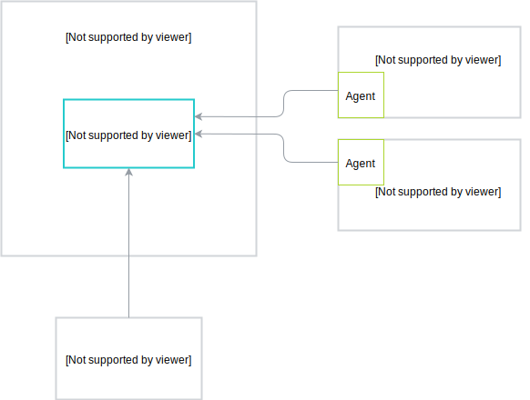

To enable Compass in Kyma, follow the instructions for the [custom component installation](/root/kyma#configuration-custom-component-installation) and enable the `compass` and `compass-runtime-agent` modules. You can also [install Kyma on a cluster](/root/kyma#installation-install-kyma-on-a-cluster) with the ready-to-use configurations for different modes. There are two modes in which you can enable Compass in Kyma: default Kyma installation and Compass as a Central Management Plane.

## Default Kyma installation

This is a single-tenant mode, which provides the complete cluster Kyma installation with all components, including Compass and Runtime Agent. In this mode, Runtime Agent is already connected to Compass and they both work in a single-tenant mode as well. Using this mode, you can register external Applications in Kyma. To enable it, follow the cluster Kyma installation and use the [`installer-cr-cluster-with-compass.yaml.tpl`](https://github.com/kyma-project/kyma/blob/master/installation/resources/installer-cr-cluster-with-compass.yaml.tpl) configuration file.


## Compass as a Central Management Plane

This is a multi-cluster mode in which you need one cluster with Compass and at least one cluster with Kyma Runtime, which you can connect and manage using Compass. This mode allows you to integrate your Runtimes with Applications and manage them in one central place.




### Kyma Compass

This is a multi-tenant and multi-Runtime mode that provides a cluster with Compass and only the selected Kyma components that Compass uses. To enable this mode, create this ConfigMap and then perform the cluster Kyma installation using the
 [`installer-cr-cluster-compass.yaml.tpl`](https://github.com/kyma-project/kyma/blob/master/installation/resources/installer-cr-cluster-compass.yaml.tpl) configuration file:

```yaml
apiVersion: v1
kind: ConfigMap
metadata:
  name: compass-overrides
  namespace: kyma-installer
  labels:
    installer: overrides
    component: compass
    kyma-project.io/installation: ""
data:
  # The parameter that enables the Compass gateway, as the default Kyma gateway is disabled in this installation mode
  gateway.gateway.enabled: "true"
  # The name of the currently used gateway
  global.istio.gateway.name: compass-istio-gateway
  # The Namespace of the currently used gateway
  global.istio.gateway.namespace: compass-system
  # The parameter that disables preconfiguration for the Compass Runtime Agent
  global.agentPreconfiguration: "false"
  # The Namespace with a Secret that contains a certificate for the Connector Service
  global.connector.secrets.ca.namespace: compass-system
```

### Kyma Runtime

This is a single-tenant mode that provides complete cluster Kyma installation with Runtime Agent. To enable this mode, follow the cluster Kyma installation and use the [`installer-cr-cluster-runtime.yaml.tpl`](https://github.com/kyma-project/kyma/blob/master/installation/resources/installer-cr-cluster-runtime.yaml.tpl) configuration file.
