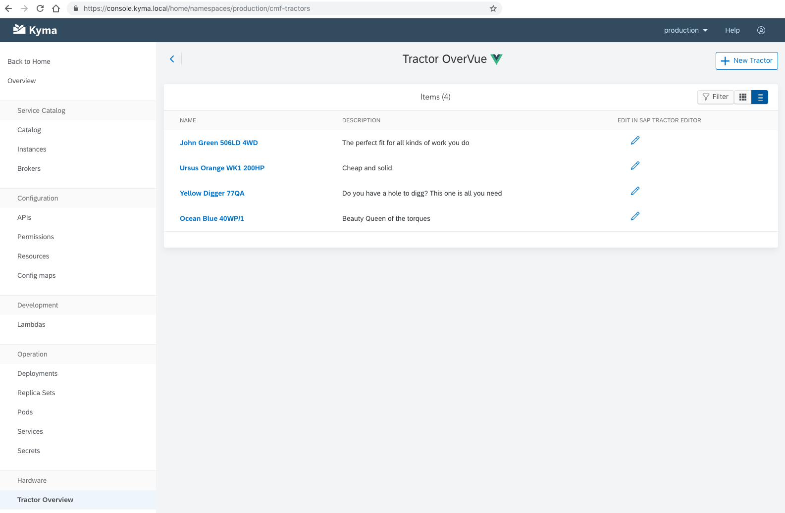
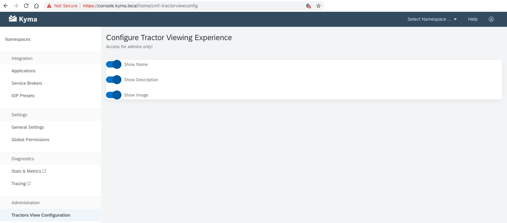

The Kyma Console UI uses the [Luigi framework](https://github.com/kyma-project/luigi) to allow you to seamlessly extend the UI content with custom micro front-ends.

## Console UI interaction with micro front-ends

When rendering the navigation, the Kyma Console UI calls a dedicated API endpoint to check if there are any micro front-ends defined in the current context. The current context comprises the current Namespace and all global cluster micro front-ends. All the defined micro front-ends and cluster micro front-ends are mapped to the navigation model as navigation nodes with remote **viewUrls**. When you click the navigation node, the system loads the content of the micro front-end into the content area of the Console. At the same time, the Console sends the current context data to the micro front-end to ensure it is initialized properly.

## Micro front-end

A micro front-end is a standalone web application which is developed, tested and deployed independently from the Kyma Console application. It uses the Luigi Client library to ensure proper communication with the Console application. When you implement and deploy a micro front-end, you can plug it to the Kyma Console as a UI extension using dedicated CustomResourceDefinitions.

### Luigi Client

The Luigi Client enables communication between the micro front-end and the Console application.
Include [Luigi Client](https://www.npmjs.com/package/@kyma-project/luigi-client) in the micro front-end's codebase as an npm dependency.

```
npm i @kyma-project/luigi-client
```
It helps to read the context data that is sent by the Console when the user activates the micro front-end in the UI.
Use the following example to read the context data:

```
LuigiClient.addInitListener((data)=>{
    // do stuff with the context data
});
```

The Luigi Client facilitates communication between the micro front-end and the Console. Use the Luigi Client API to request the Console to navigate from the micro front-end to any other route available in the application:

```
LuigiClient.linkManager().navigate('/targetRoute', null, true)
```

For API details, see [Luigi Client API documentation](https://github.com/kyma-project/luigi/blob/master/docs/luigi-client-api.md).


## Add a micro front-end

Use the CustomResourceDefinitions to extend the Console functionality and configure different scopes for your micro front-ends.

### Micro front-end for a specific Namespace

You can define a micro front-end visible only in the context of a specific Namespace.

[Here](./assets/mf-namespaced.yaml) you can find a sample micro front-end entity using the **namespace** metadata attribute to enable the micro front-end **only** for the production Namespace.

Using this yaml file in your Kyma cluster results in a **Tractors Overview** micro front-end navigation node displayed under the **Hardware** category. It is available **only** in the production Namespace.



### Cluster-wide micro front-end
You can define a cluster-wide micro front-end available for all Namespaces in the side navigation.

[Here](./assets/cmf-environment.yaml) you can find a sample ClusterMicroFrontend entity using the `namespace` value for the **placement** attribute to make the micro front-end available for all Namespaces in the cluster.

Using this yaml file in your Kyma cluster results in a **Tractors Overview** micro front-end navigation node displayed under the **Hardware** category. It is available **for every** Namespace in your cluster.

### Cluster-wide micro front-end for the administration section
You can define a cluster micro front-end visible in the **Administration** section of the Console.

[Here](./assets/cmf-cluster.yaml) you can find a sample of such ClusterMicroFrontend entity using the `cluster` value for placement  **attribute** to ensure the micro front-end is visible in the **Administration** section.


