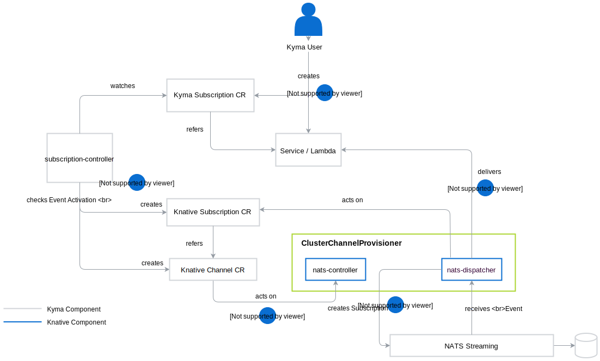
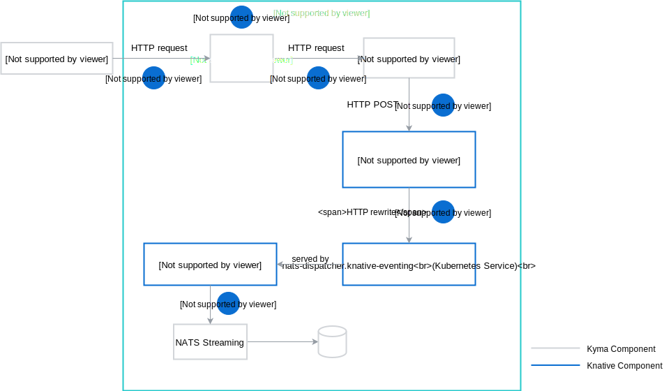
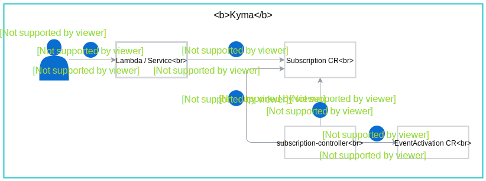

## Event consumption

When you create a lambda or a service to perform a given business functionality, you must define which Events trigger it. Define triggers by creating the [Subscription CR](/components/event-bus/#custom-resource-subscription) where you instruct the Event Bus to forward the Events of a particular type to your lambda.
For example, whenever the `order-created` Event comes in, the Event Bus stores it in NATS Streaming. It then dispatches it to the receiver specified in the Subscription CR definition.

> **NOTE:** The Event Bus creates a separate Event trigger for each Subscription.

1. A user creates a lambda or a service that an Event coming from an external solution triggers.
    >**NOTE**: When creating a service, the user must create a Kyma Subscription resource manually. If the user uses Kyma Console UI to create a lambda, the Subscription resource is created automatically. In any other case, Kyma Subscription must be created manually.
    
2. **subscription-controller-knative** reacts to the creation of Kyma Subscription.  It [verifies](#event-validation) if the Event type from the application can be consumed in the Namespace where the Kyma Subscription has been created.  If so, it creates the Knative Channel and Knative Subscription resources.
3. **nats-controller** reacts to the creation of a Knative Channel and creates the required Kubernetes services.
4. **nats-dispatcher** reacts to the creation of a Knative Subscription and creates the NATS Streaming Subscription.
5. **nats-dispatcher** picks the Event and dispatches it to the configured lambda or the service URL as an HTTP POST request. The lambda reacts to the received Event.

## Event publishing

1. The external application integrated with Kyma makes a REST API request to the Application Connector's Events Gateway to indicate that a new Event is available. The request provides the Application Connector with the Event metadata.
2. The Application Connector enriches the Event with the details of its source.

    > **NOTE:** There is always one dedicated instance of the Application Connector for every instance of an external solution connected to Kyma.

3. The Application Connector makes a REST API call to **publish-knative** and sends the enriched Event.
4. **publish-knative** makes the HTTP payload compatible with Knative and sends the Event to the relevant **knative-channel** service URL which is inferred based on **source id**, **event type**, and **event type version** parameters.
5. Kubernetes service forwards the Event to the **nats-dispatcher** service served by the **nats-dispatcher** Pod.
6. **nats-dispatcher** saves the Event in NATS Streaming which stores the Event details in the Persistence storage volume.

## Event validation

 **subscription-controller-knative** checks if the Namespace can receive Events from the application. It performs the check for each Kyma Subscription created in a Namespace for a particular Event type with a version for a specific application.

### Validation flow

See the diagram and a step-by-step description of the Event verification process.

1. The Kyma user defines a lambda or a service.
2. The Kyma user creates a Subscription custom resource.
3. **subscription-controller-knative** reads the new Subscription.
4. **subscription-controller-knative** reads the EventActivation CR to verify if it exists in the Namespace for a certain application.
5. **subscription-controller-knative** updates the Subscription resource accordingly with the activation status `true` or `false`. The Event Bus uses this status to allow or prohibit Event delivery.
