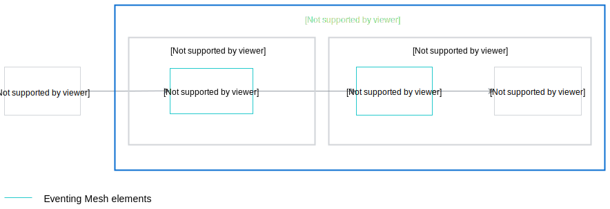
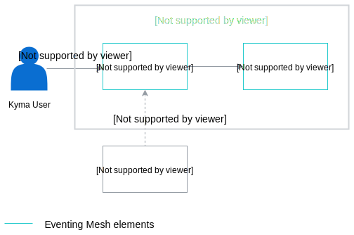

## Overview

Knative eventing mesh leverages Knative Eventing components to build an eventing mesh that provides event routing and pub/sub capabilities. It abstracts the underlying messaging system and allows you to configure different persistence per Namespace. Kyma components wire the mesh dynamically for event routing enabling senders to inject Events into the mesh from multiple source points. Additionally, many subscribers can receive Events based on filters and their access permissions. The [Knative Broker and Trigger](https://knative.dev/docs/eventing/broker-trigger/) CRDs allow the process of Event publishing and consumption to run smoother, thus significantly improving the overall performance.   

 >**NOTE:** Knative eventing mesh is available in alpha version. Use it only used for testing purposes.
 
 The new eventing mesh runs in parallel with the existing Event Bus. Sending Events to the regular eventing endpoint still uses Kyma Event Bus, while a separate Kyma endpoint handles sending Events to the new Knative eventing mesh. 
 

## Send Events

The diagram shows you the main stages of the Event flow from the moment it is sent by the external Application up to when it is received by the lambda function.  

>**NOTE**: The flow you’ve already used Kyma console to add a service instance of the external application to your namespace, and you have created a lambda that has an Event trigger. 

1. The Application sends Events compliant with the [CloudEvents 1.0 specification](https://github.com/cloudevents/spec/blob/v1.0/spec.md). 
2. These Events reach the [HTTP  Source adapter](https://github.com/kyma-project/kyma/tree/master/components/event-sources/adapter/http) which is an HTTP server deployed inside the `kyma-integration` Namespace. 

2. The HTTP Source adapter forwards the Events to the default [Knative Broker](https://knative.dev/docs/eventing/broker-trigger).

3. The Knative Broker then delivers Events to the proper lambda function. 

## Subscribe to Events 

In the new Knative Eventing mesh, you can use Knative Triggers to subscribe to any Events delivered to the Broker located in the user Namespace.  
You can also create expressions which allow the Trigger to filter the incoming events. For details on setting filters, read the **Trigger filtering** section [this](https://knative.dev/docs/eventing/broker-trigger/) document. 