# Description

This is a self-contained guide that demonstrates setting up an event trigger for a microservice deployed in Kyma. It serves as a refrence for developers who wish to configure their microservices with event trigger.

It uses:

* [http-db-service](https://github.com/kyma-project/examples/tree/master/http-db-service) as a reference microservice that is deployed in the `demo-event-service-trigger` namespace. It will be configured to consume `order.created` event from the application.
* [commerce-mock](https://github.com/SAP/xf-application-mocks/tree/master/commerce-mock) as a reference enterprise application that connects to Kyma. This application will send the event to Kyma which will trigger the microservice.

### Set up commerce mock.

This section will

* Deploy a mock commerce application on Kyma.

* Expose the commerce mock URL.

* Establish secure connection via the Kyma application connector.

* Register the events that can be sent from the mock commerce application to Kyma.

> **NOTE:** This will be replaced by an actual enterprise application that will connect to Kyma.

1. Create a namespace `mocks` in the Kyma console.

    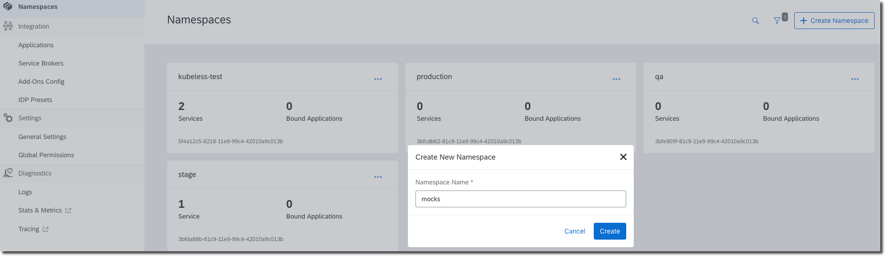

1. Deploy the [mock commerce application](https://raw.githubusercontent.com/SAP/xf-application-mocks/master/commerce-mock/deployment/xf.yaml).

    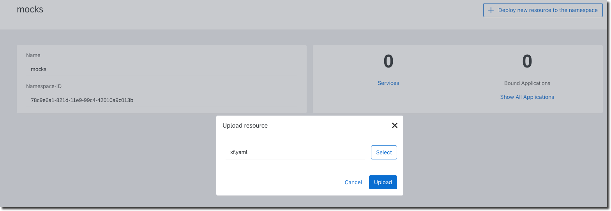

1. Create a new application `sample-enterprise`.

    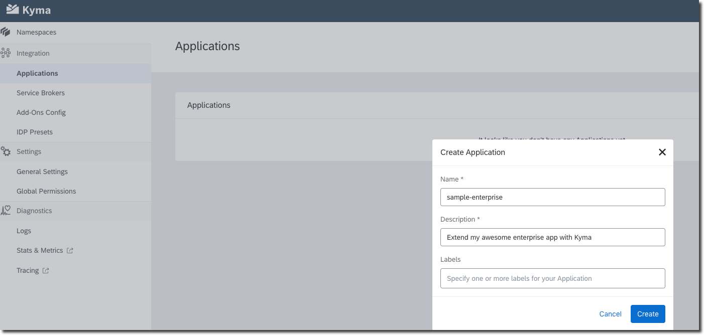

1. Copy the URL to connect the application.

    

1. Access the commerce mock at https://commerce.{CLUSTER_DOMAIN} .

In the commerce mock User Interface,

1. Connect the `sample-enterprise` to mock commerce.

    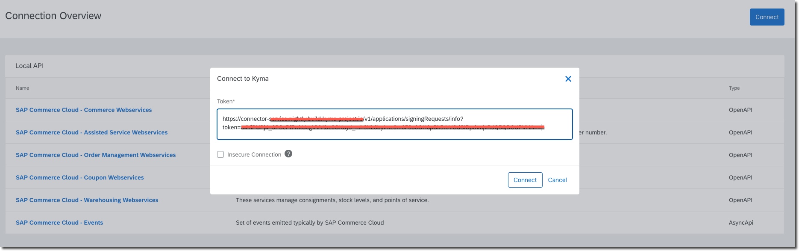
    
1. Register the `SAP Commerce Cloud - Events`. After registration, it will be available under the `Remote APIs` section.

    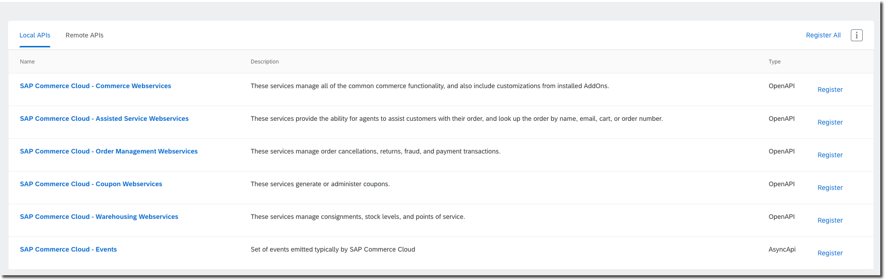

### Expose the events from the application to namespace in Kyma.

After the application has registered the events that it can send to Kyma, next step would be make them accessible to various serverless workloads (lambdas/microservices) running inside Kyma. Since multiple applications can connect to Kyma, each Kyma namespace is declaratively bound to an application and then the events are made accessible by adding the event catalog to the namespace.

1. Create the namespace `demo-event-service-trigger`.

    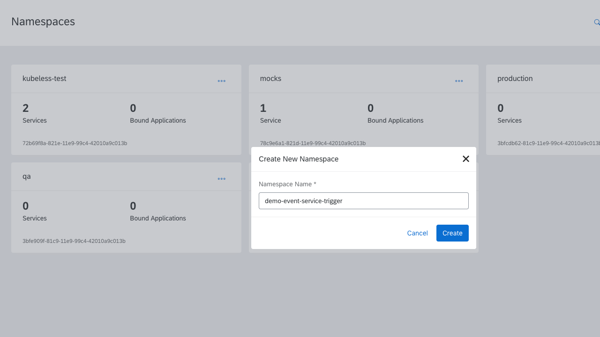

1. Bind the application to the namespace.

    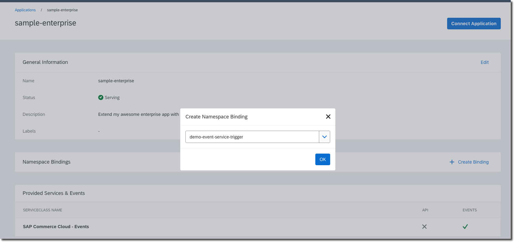

1. `SAP Commerce Cloud - Events` will be available in the catalog. Add them once to enable serverless workloads to consume events.

    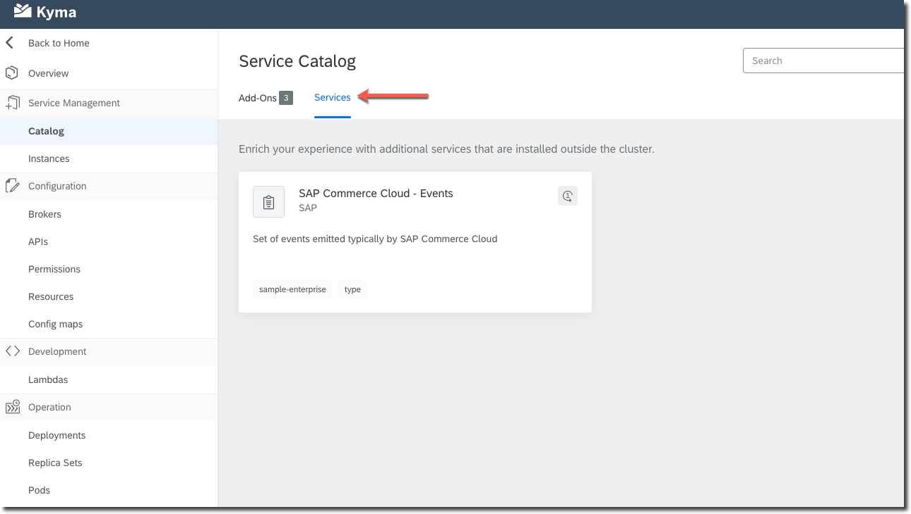
    
    

### Service deployment

Deploy the [http-db-service](https://raw.githubusercontent.com/kyma-project/examples/master/http-db-service/deployment/deployment.yaml). It exposes a `/events/order/created` endpoint to handle order created event.

    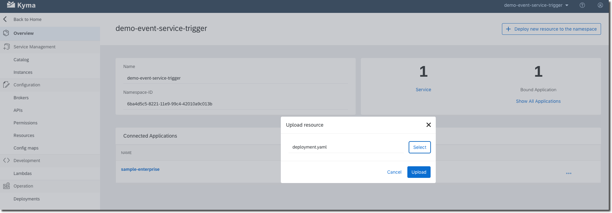
    
### Create the Kyma subscription

By creating a Kyma Subscription, we configure an event trigger (order.created) for the microservice. This implies whenever the application sends an `order.created` event, the event will be delivered as an HTTP POST request to the endpoint of the microservice.

1. Create the [Kyma subscription](./assets/event-trigger-subscription.yaml) by either deploying the Kyma Subscription custom resource from console UI or using the kubectl command.

    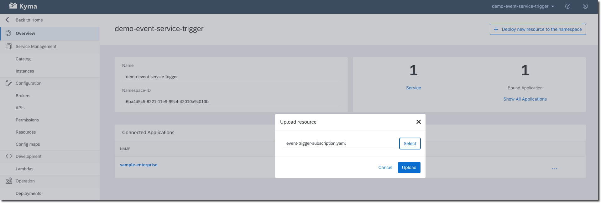
	
	Please refer to [custom resource parameters](./06-01-subscription.md#custom-resource-parameters) for understanding different parameters. 
	The main value is `endpoint` which is of the form `http://{service-name}.{namespace-in-which-service-is-deployed}:{service-port}/{uri-path-to-handle-events}`

```yaml
apiVersion: eventing.kyma-project.io/v1alpha1
kind: Subscription
metadata:
  name: example-subscription
  labels:
    example: example-subscription
spec:
  endpoint: http://http-db-service.demo-event-service-trigger:8017/events/order/created
  include_subscription_name_header: true
  max_inflight: 10
  push_request_timeout_ms: 60
  event_type: order.created
  event_type_version: v1
  source_id: sample-enterprise
```

### Send and verify

1. Send the event from the commerce mock User Interface. It is accessible at https://commerce.{CLUSTER_DOMAIN} .

    * Navigate to Remote APIs --> SAP Commerce Cloud - Events 
    * Send the `order.created.v1` event
    
        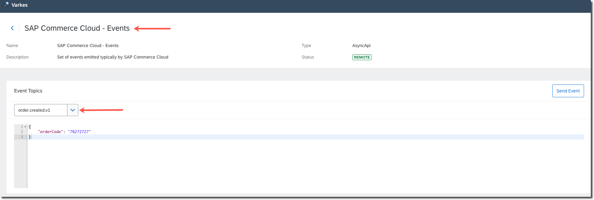 

2. Access the logs and verify.

    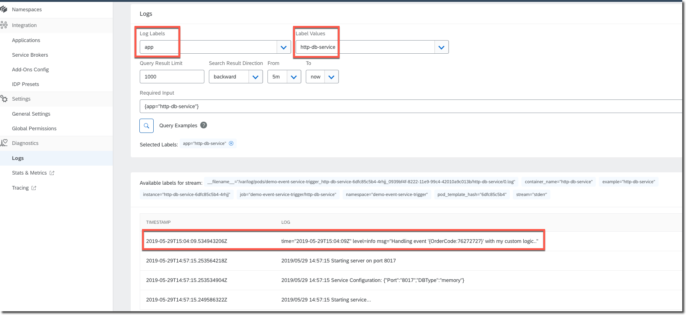
