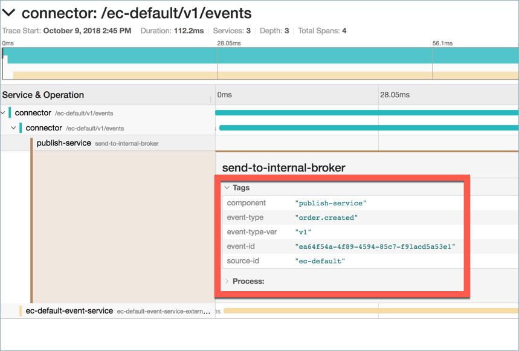
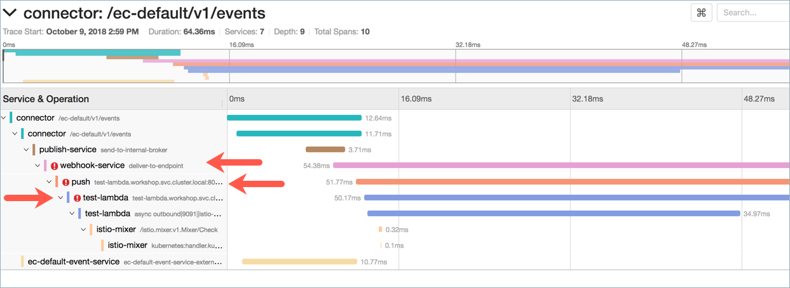
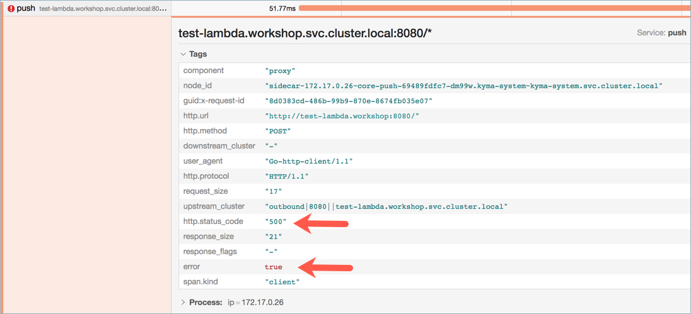
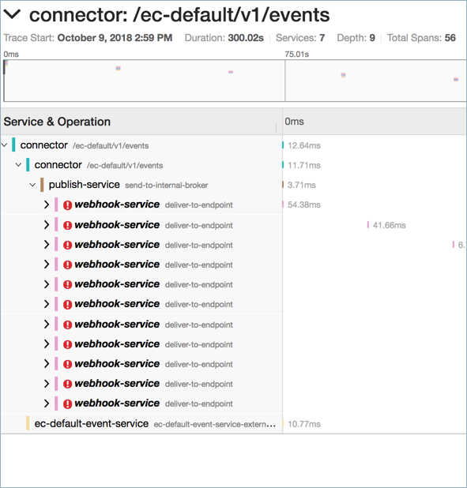

The tracing functionality available in Kyma can help you to pinpoint the root cause of an error and solve the problem. See [this](docs/components/tracing/#overview-overview) document to learn more about tracing.

## No microservice or lambda configured to receive an Event

In this case, an external system sends the Event, but
a lambda or microservice with an Event trigger does not exist.

As a result, you can see traces for `publish` only. When you access the trace details, they only show you tags for `event-publish-knative-service`.

## Configured microservice or lambda returns an error

In this case, a microservice or lambda exists and reacts to
the Event trigger. However, due to a code issue, the microservice or lambda 
fails to process the Event.

As a result, the `webhook`, `push`, and `name-of-lambda` services in the trace are marked with error.

To see the error details, click one of the service spans, such as the one for the `push` service.

Since the Event Bus keeps on retrying to deliver the Event until it is successful, you 
can see multiple spans for `webhook-service`.

