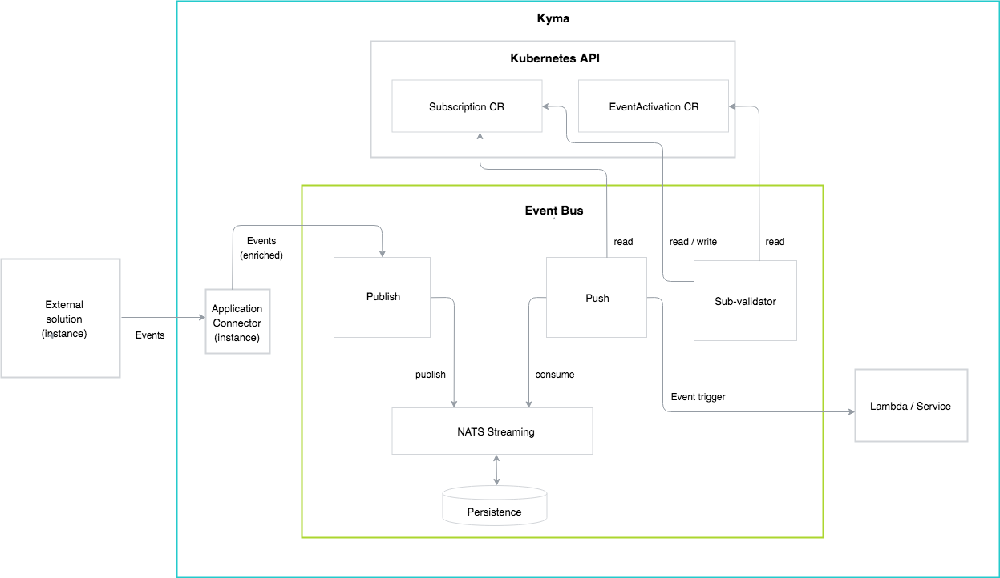
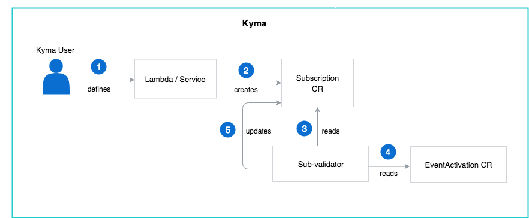

See the diagram and steps for an overview of the basic Event Bus flow:

## Event flow

1. The external solution integrated with Kyma makes a REST API call to the Application Connector to indicate that a new Event is available.

2. The Application Connector enriches the Event with the details of its source.

> **NOTE:** There is always one dedicated instance of the Application Connector for every instance of an external solution connected to Kyma.

3. The Application Connector makes a REST API call to `publish` and sends the enriched Event.

4. `publish` saves the information in the NATS Streaming database.

5. NATS Streaming stores the Event details in the Persistence storage volume to ensure the data is not lost if the NATS Streaming crashes.

6. If the Subscription [validation process](#architecture-architecture-event-validation) completes successfully, `push` consumes the Event from NATS Streaming.

7. `push` delivers the Event to the lambda or the service.

## Event validation

The Event Bus performs Event validation before it allows Event consumption.

### Validation details

When you create a lambda or a service to perform a given business functionality, you also need to define which Events trigger it. Define triggers by creating the Subscription custom resource in which you register with the Event Bus to forward the Events of a particular type, such as `order-created`, to your lambda or a service. Whenever the `order-created` Event comes in, the Event Bus consumes it by saving it in NATS Streaming and Persistence, and sends it to the correct receiver specified in the Subscription definition.

> **NOTE:** The Event Bus creates a separate Event Trigger for each Subscription.

Before the Event Bus forwards the Event to the receiver, the sub-validator performs a security check to verify the permissions for this Event in a given Namespace. It reads all new Subscription resources and refers to the EventActivation resource to check whether a particular Event type is enabled in a given Namespace. If the Event is enabled for an Namespace, it updates the Subscription resource with the information. Based on the information, `push` sends the Event to the lambda or the service.

### Validation flow

See the diagram and a step-by-step description of the Event verification process.

1. Kyma user defines a lambda or a service.
2. Kyma user creates a Subscription custom resource.
3. The sub-validator reads the new Subscription.
4. The sub-validator refers to the EventActivation resource to check if the Event in the Subscription is activated for the given Namespace.
5. The sub-validator updates the Subscription resource accordingly.
