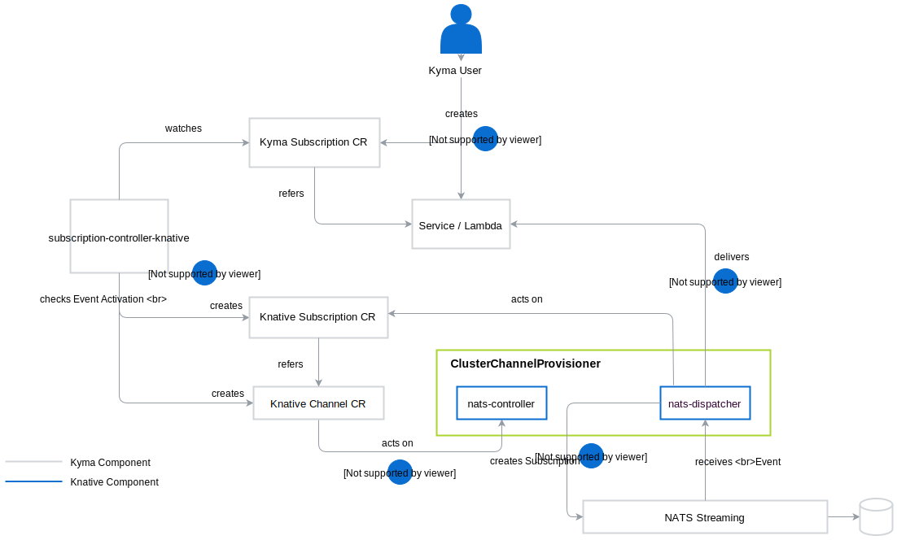
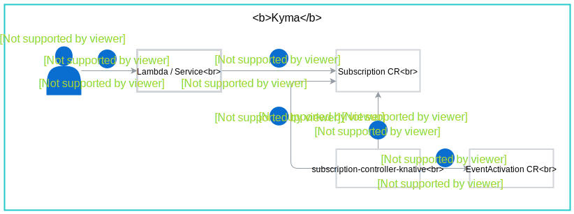

See the diagram overview of the Event flow configuration and Event cons

## Eventing configuration 

1. A user configures a lambda or a serverless application to be triggered by an Event from an external solution. 
>**NOTE**: For a serverless application the user must create a Kyma Subscription resource manually. For a lambda, the it is created automatically.
2. The `subscription-controller-knative` reacts on the creation of Kyma Subscription. It [validates](#event-validation) the Event and creates a Knative Channel and a Knative Subscription resources.
3. The `nats-controller` reacts on the creation of a Knative Channel and creates the required Kubernetes and Istio services.
4. The `nats-dispatcher` reacts on the creation of a Knative Subscription and creates the NATS Streaming subscription. 

## Event consumption

1. The `nats-dispatcher` picks the Event and dispatches it to the configured lambda or the microservice URL as an HTTP POST request.
2. The lambda reacts on the delivered Event. 

## Event publishing

1. The external application integrated with Kyma makes a REST API request to the Application Connector's Events Gateway to indicate that a new Event is available. The request provides the Application Connector with the Event metadata. 
2. The Application Connector enriches the Event with the details of its source.

> **NOTE:** There is always one dedicated instance of the Application Connector for every instance of an external solution connected to Kyma.

3. The Application Connector makes a REST API call to `publish-knative` and sends the enriched Event.
4. `publish-knative` makes the HTTP payload compatible with Knative and sends the Event to the relevant `knative-channel` service URL which is inferred based on **source id** , **event type** and **event type version** parameters.
5. Istio Virtual Service forwards the Event further to the `nats-dispatcher` service served by the `nats-dispatcher` Pod.
6. The NATS dispatcher stores the Event in NATS Streaming.
7. NATS Streaming stores the Event details in the Persistence storage volume to ensure the data is not lost if the NATS Streaming crashes.

## Event validation 

When you create a lambda or a service to perform a given business functionality, you also need to define which Events trigger it. Define triggers by creating the Subscription custom resource in which you register with the Event Bus to forward the Events of a particular type, such as `order-created`, to your lambda or a service. Whenever the `order-created` Event comes in, the Event Bus consumes it by saving it in NATS Streaming and Persistence, and sends it to the correct receiver specified in the Subscription definition.

> **NOTE:** The Event Bus creates a separate Event Trigger for each Subscription.

Before the Event Bus forwards the Event to the receiver, the sub-validator performs a security check to verify the permissions for this Event in a given Namespace. It reads all new Subscription resources and refers to the EventActivation resource to check whether a particular Event type is enabled in a given Namespace. If the Event is enabled for an Namespace, it updates the Subscription resource with the information. Based on the information, `push` sends the Event to the lambda or the service.

### Validation flow

See the diagram and a step-by-step description of the Event verification process.

1. The Kyma user defines a lambda or a service.
2. The Kyma user creates a Subscription custom resource.
3. The Subscription Controller reads the new Subscription.
4. The Subscription Controller refers to the EventActivation resource to check if the Event in the Subscription is activated for the given Namespace.
5. The Subscription Controller updates the Subscription resource accordingly.
