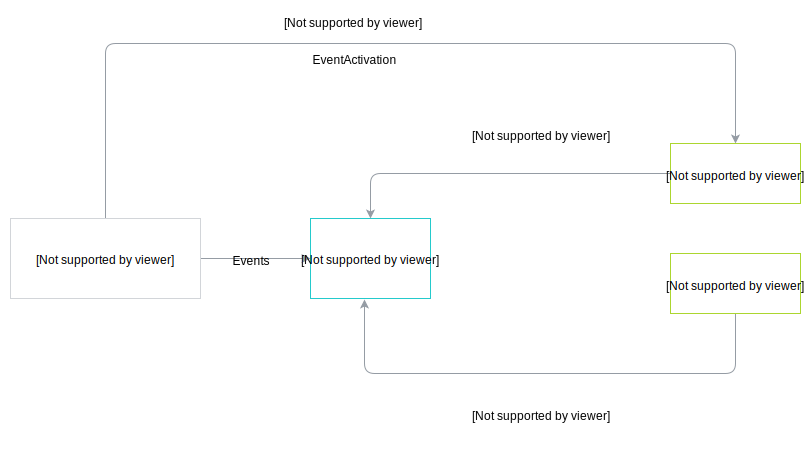

The Event Bus enables a successful flow of Events in Kyma when:

- You have enabled the [EventActivation](/components/event-bus#details-basic-concepts) controller.
- You have created a [Subscription](/components/event-bus#custom-resource-subscription) custom resource and registered the webhook for a lambda or service to consume the Events.
- The Events are [published](#details-event-flow-requirements-event-publishing).

### Activate Events

Enable the EventActivation controller to ensure the Event flow between the Namespace and the Application (App). 
Alternatively, [bind](/components/application-connector#tutorials-bind-an-application-to-a-namespace) the App to the Namespace and create a Service Instance.

The diagram shows you the Event activation flow for a given Namespace.

The App sends the Events to the Event Bus and uses the EventApplication controller to ensure the Namespace receives the Events.  If you define a lambda in the `prod123` Namespace, it receives the **order.created** Event from the App through the Event Bus. The lambda in the `test123` Namespace does not receive any Events, since you have not enabled the EventActivation controller.

### Consume Events

Configure lambdas and services to use the `push` command for consuming Events coming from the App. To make sure the lambda or the service receive the Events, register a webhook for them by creating a [Subscription custom resource](/components/event-bus#custom-resource-subscription). 

### Publish Events

Make sure that the external solution sends Events to Kyma. For details of the Event flow, see [this](/components/event-bus#architecture-architecture) document.
