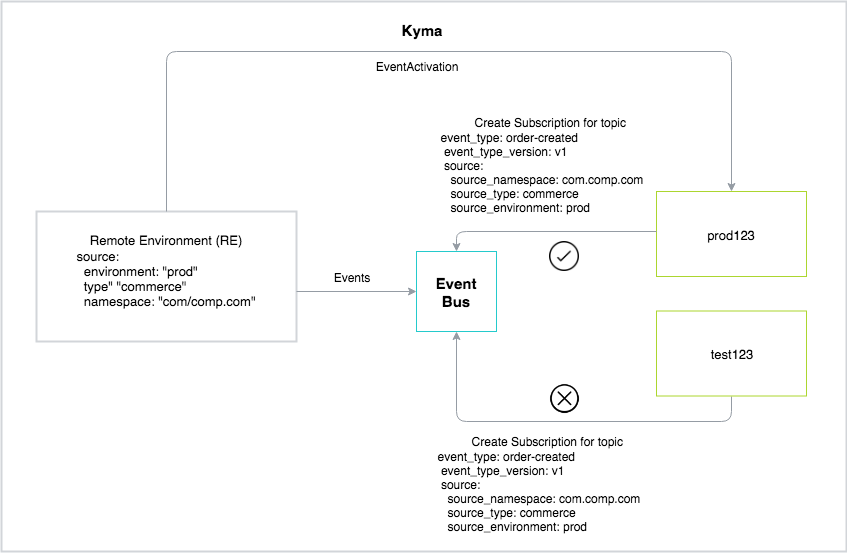

The Event Bus enables a successful flow of the Events in Kyma when:

- The [EventActivation](#details-event-flow-requirements-activate-events) is in place.
- You create a [Subscription](#details-event-flow-requirements-consume-events) Kubernetes custom resource and register the webhook for the lambda or a service to consume the Events.
- The Events are [published](#details-event-flow-requirements-event-publishing).

## Details

See the following subsections for details on each requirement.

### Activate Events

To receive Events, use EventActivation between the Namespace and the Application (App).

For example, if you define the lambda in the `test123` Namespace and want to receive the `order-created` Event type from the `ec-qa` App, you need to enable the EventActivation between the `test123` Namespace and the `ec-qa` App. Otherwise, the lambda cannot receive the `order-created` Event type.

### Consume Events

Enable lambdas and services to consume Events in Kyma between any Namespace and an App using `push`. Deliver Events to the lambda or the service by registering a webhook for it. Create a Subscription Kubernetes custom resource to register the webhook.

See the table for the explanation of parameters in the Subscription custom resource.

| Parameter | Description |
|----------------|------|
| **include_subscription_name_header** | It indicates whether the lambda or the service includes the name of the Subscription when receiving an Event. |
| **max_inflight** | It indicates the maximum number of Events which can be delivered concurrently. The final value is the **max_inflight** number multiplied by the number of the `push` applications. |
| **push_request_timeout_ms** | It indicates the time for which the `push` waits for the response when delivering an Event to the lambda or the service. After the specified time passes, the request times out and the Event Bus retries delivering the Event. Setting the **minimum** parameter to `0` applies the default value of 1000ms. |
| **event_type** | The name of the Event type. For example, `order-created`.|
| **event_type_version** | The version of the Event type. For example, `v1`. |
| **source** | Details of the App that the Event originates from. |
| **source_environment** | The source Namespace of the Event. |
| **source_namespace** | The parameter that uniquely identifies the organization publishing the Event. |
| **source_type** | The type of the Event source. For example, `commerce`. |

### Event publishing

Make sure that the external solution sends Events to Kyma.
