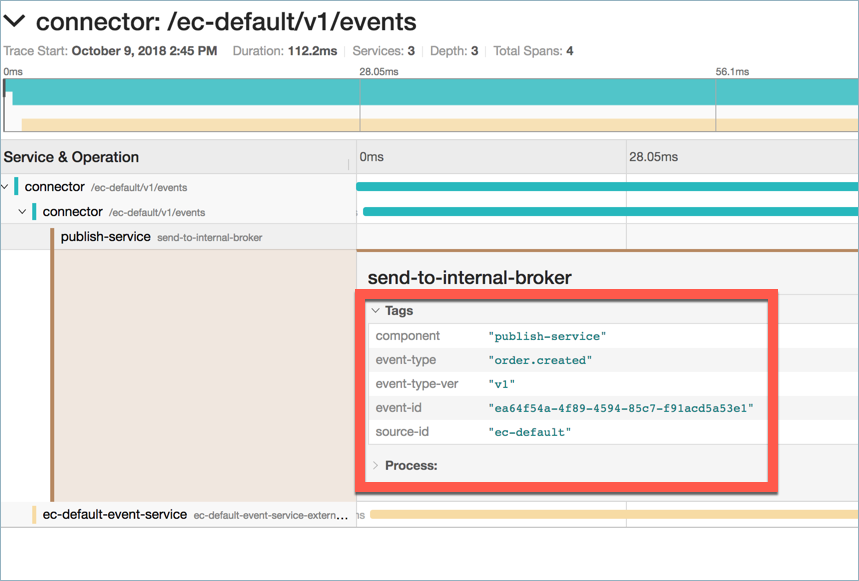

---
title: Troubleshooting
type: Details
---

In some cases, you can encounter some problems related to eventing. This
document introduces several ways to troubleshoot such problems.

## General Troubleshooting Guidelines

* If the lambda or the service does not receive any Events, check the following:
  - Confirm that the EventActivation custom resource is in place.
  - Ensure that the webhook defined for the lambda or the service is up and
    running.
  - Make sure the Events are published.

* If errors appear while sending Events:
  - Check if the `publish` application is up and running.
  - Make sure that NATS Streaming is up and running.

 If these general guidelines do not help, go to the next section of this
 document.

## Troubleshooting using Kyma Tracing

Tracing allows you to troubleshoot different problems that you might encounter
while using Kyma. Understanding the common scenarios and how the expected traces
look like gives you a better grasp on how to quickly use Kyma tracing
capabilities to pinpoint the root cause. See the exemplary scenario for
reference.

### Scenario: I have no microservice or lambda configured to receive an Event

This scenario assumes that there is an Event sent from the external system but
there is no lambda or microservice configured with the Event trigger.

As a result, only the trace for the `publish` and initial services are visible.

In the trace details, you can see the tags for the `publish-service`.

