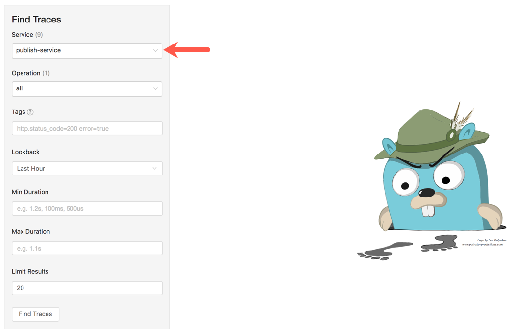

---
title: Troubleshooting
type: Details
---
## General Troubleshooting Guidelines

* If the lambda or the service does not receive any Events, check the following:
  - Confirm that the EventActivation is in place.
  - Ensure that the webhook defined for the lambda or the service is up and running.
  - Make sure the Events are published.

* If errors appear while sending Events:
  - Check if the `publish` application is up and running.
  - Make sure that NATS Streaming is up and running.

## Troubleshooting Using Kyma Tracing

Tracing allows you to troubleshoot different problems that you might encounter while using Kyma. Understanding common scenarios and how the expected traces look gives you a better grasp on how to quickly use Kyma tracing capabilities to pinpoint the root cause.

### I have no microservice or lambda configured to receive an event

#### Scenario

There is an Event sent from the external system. But, there is no lambda or microservice configured with the Event trigger.

#### Expected Traces

Only the trace for the `publish` and initial services will be visible.

In the trace details, you can see the tags for the `publish-service`

