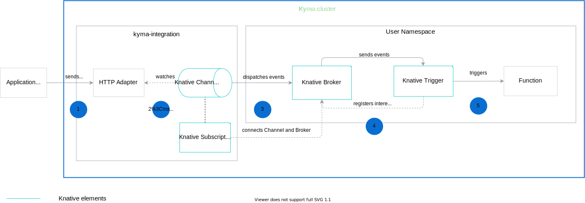

The event processing and delivery flow in the Event Mesh uses the Broker and Trigger concepts to forward events and deliver them to the subscribers.
This diagram explains the event flow in Kyma, from the moment the Application sends an event, to the point when the event triggers the Function.



1. The Application sends events to the HTTP Source Adapter which forwards them to a resource such as the Broker.

    >**NOTE:** The HTTP Source Adapter accepts only CloudEvents in version 1.0.

Before Kyma Version 1.11, the Application sent events to the `/v1/events` endpoint exposed by an event-service created per application. This service was responsible for sending events to the Event Bus, which back then handled event processing and delivery. In Event Mesh, the events are sent to the `/events` endpoint exposed direcly by the Mesh to receive CloudEvents in version 1.0. 

It may happen, that you are still using the previous endpoint to receive the events. That is why the event-service was refactored into a compatibility layer. This layer makes sure the the events received by the `/v1/events` endpoint meet the contract of application connectivity and can be forwarded to the subscriber. To achieve that, it consumes the events non-CloudEvent format, translates them into CloudEvents, and propagates to the new Event Mesh. 

2. The Subscription defines the Broker as the subscriber. This way, the Channel can communicate with the Broker to send events.

3. The Channel listens for incoming events. When it receives an event, the underlying messaging layer dispatches it to the Broker.

4. The Broker sends the event to the Trigger which is configured to receive events of this type.

5. The Trigger filters the events based on the attributes you can find in the [Trigger specification](https://knative.dev/v0.12-docs/eventing/broker-trigger/). See the example of a Trigger CR:

```yaml
apiVersion: eventing.knative.dev/v1alpha1
kind: Trigger
metadata:
  name: test-trigger
  namespace: serverless
spec:
  broker: default
  filter:
    attributes:
      type: user.created # Event name
      eventtypeversion: v1 # Event version
      source: mock # Application name
  subscriber:
    ref:
      apiVersion: serving.knative.dev/v1
      kind: Service
      name: test-function # Function name
```

The **filter** section of the Trigger CR specification defines the Broker which receives events and parameters you must provide for the Trigger to forward events to subscribers. These parameters are not fixed and depend on a given use case. In Kyma, these are the mandatory ones:

| Parameter  |  Description  |
|------------|-------------- |
| **spec.broker** | Name of the Broker that receives events. By default, it receives the value `default` when the user's Namespace is labeled with `knative-eventing-injection`.  |
| **spec.filter.attributes.type** | Specific event type to which you want to subscribe your Function, such as `user.created`.|
| **spec.filter.attributes.eventtypeversion** | Event version, such as `v1`. |
| **spec.filter.attributes.source** | Name of the Application which sends events. |

To learn how to trigger a Function with an event, follow the [tutorial](/components/serverless/#tutorials-trigger-a-function-with-an-event).
