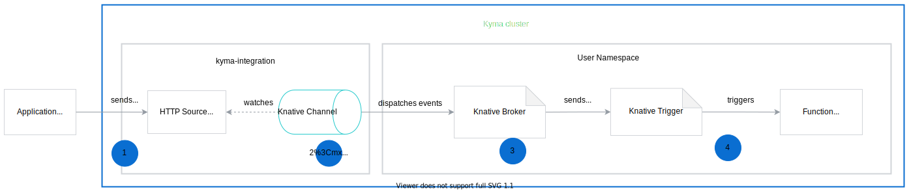

The architecture of Knative Eventing Mesh relies heavily on the functionality provided by [Knative Eventing](https://knative.dev/docs/eventing/). To ensure a stable event flow between the Sender and the Subscriber, the Knative Eventing Mesh wires the Knative elements closely with the existing Kyma components.

## Knative Eventing Mesh implementation

This diagram shows how the Knative elements are implemented and wired with the already exisitng Kyma components, whereas the second diagram shows you how the events are processed by in Kyma.

1. The user creates the [Application CR](https://kyma-project.io/docs/components/application-connector/#custom-resource-application) and binds it to the Namespace. 
2. The Application Operator watches the creation of an Application CR and creates the HTTP Source CR, which defines the event sources the events can come from. 
3. The Event Source Controller watches the creation of the HTTP Source CR and deploys these resources:
    * [HTTP source adapter](https://github.com/kyma-project/kyma/tree/master/components/event-sources/adapter/http) which is an HTTP server deployed inside the `kyma-integration` Namespace. The adapter acts as a gateway to the Knative Channel, and its responsibility is to expose an endpoint the Application sends the events to. 
    * [Knative Channel](https://knative.dev/docs/eventing/channels/) CR which defines persistence layer and is responsible for dispatching events to multiple destinations. 
4. The Application Broker watches the creation of the Application CR and performs the following actions:
    * Exposes event definitions as an event ServiceClass. Once the Application Broker provisions the ServiceClass, the events become available for services. 
    * Creates the Knative Subscription CR which enables forwarding events received by the Knative Channel to Subscribers or other Channels. 
    * Injects the [Knative Broker](https://knative.dev/docs/eventing/broker-trigger/) CR to the User Namespace. The Broker acts as an entry point for the events. 
5. The user creates the [Knative Trigger](https://knative.dev/docs/eventing/broker-trigger/) CR which defines the subscriber along with the conditions for filtering out events. This way, certain subscribers receive only the events they are interested in. For details on Trigger CR specification, see the **Trigger Filtering** section of [this](https://knative.dev/docs/eventing/broker-trigger/) document.

## Event flow 

This diagram explains the event flow in Kyma, from the moment the Application sends an event to the point where it triggers a specific function.

1. The Application sends events to endpoint speficed in the HTTP source adapter definition.
    >**NOTE:** The HTTP source adapter accepts only CloudEvents in version 1.0. 
2. Knative Channel listens for incoming events and sends them to Knative Broker.
3. Knative Trigger receives events based on the filters defined in its specification. 
4. Knative Trigger forwards them to Subscribers, such as lambda functions or services. The function is triggered if the event meets conditions specified in its definition.
