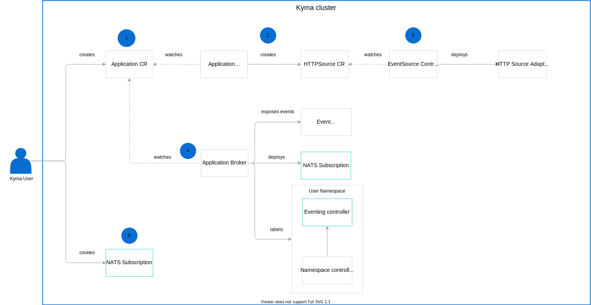

Kyma Eventing uses NATS to implement an Event Publishing Proxy and Eventing controller.

This diagram shows how the Eventing components work together.

## Event types

Kyma Eventing supports both cloud events and legacy events. Kyma converts legacy events to cloud events and adds the prefix `sap.kyma`.

For a subscription CR, the fully qualified event-type is in the form `sap.kyma.custom.commerce.order.created.v1`.
​
For the publishers it is:
- `order.created` for legacy-events coming from the `commerce` application.
- `sap.kyma.custom.commerce.order.cre`
