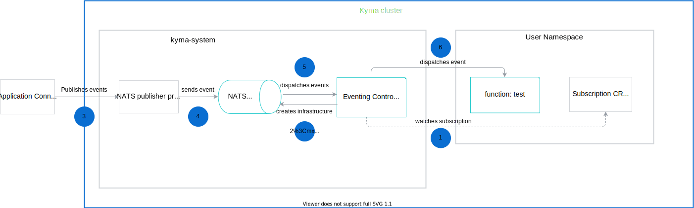

The event processing and delivery flow in the Event Mesh uses NATS server to process events and send them to subscribers.
This diagram explains the event flow in Kyma, from the moment the Application sends an event, to the point when the event triggers the Function.

1. The Eventing Controller watches the Subscription Custom Resource. It determines if there are any new incoming events.

2. The NATS Eventing Controller creates infrastructure for the NATS server.

3. The [Application Connector](https://kyma-project.io/docs/components/application-connector/) publishes events to the NATS publisher proxy.

4. The NATS publisher proxy sends events to the NATS server.

5. The NATS server dispatches events to the NATS Eventing Controller.

6. The NATS Eventing Controller dispatches events to subscribers (microservices or Serverless functions).
