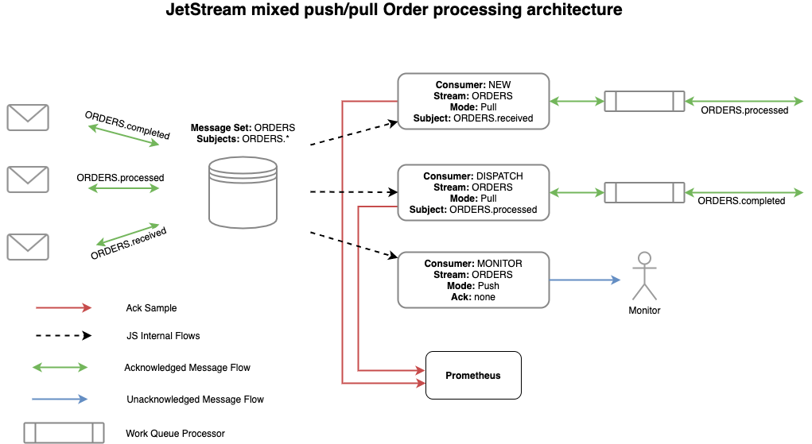

# NATS - JetStream

## Check deployment (nats operator vs helm charts)
> Q: Should we use Operator or Helm? How do we setup a cluster of size 1 or 3, that can use a PV?

* NATS Operator officially discourages to use nats-operator for new deployments. Also support for JetStreams by nats-operator is questionable.
> The recommended way of running NATS on Kubernetes is by using the Helm charts. If looking for JetStream support, this is supported in the Helm charts. The NATS Operator is not recommended to be used for new deployments.
([Reference](https://github.com/nats-io/nats-operator#nats-operator))

### Deploy NATS with JetStream using Helm chart

>Reference: [JetStream with NATS Helm Chart](https://github.com/nats-io/k8s/tree/main/helm/charts/nats#jetstream)

1. Download latest nats helm chart from [here](https://github.com/nats-io/k8s/releases/).
2. Enable JetStream in `Values.yaml` file.
```
  jetstream:
    enabled: true
```
3. Configure clustering in `Values.yaml` file if needed. [More info](https://docs.nats.io/jetstream/clustering) on clustering with JetStream.
```
cluster:
  enabled: true
  # Cluster name is required, by default will be release name.
  # name: "nats"
  replicas: 3
  noAdvertise: false
```
4. Install NACK using helm:
```
cd <NATS_HELM_CHART_DIR>
helm install nats . -n <NAMESPACE>
```
> Note: Existing PVC can also be assigned for JetStream fileStorage as described [here](https://github.com/nats-io/k8s/tree/main/helm/charts/nats#using-with-an-existing-persistentvolumeclaim).

## Configuration of streams using [NACK](https://github.com/nats-io/nack#getting-started)

* NACK allows to manage JetStream streams using k8s CRDs. The CRDs includes for defining Streams and Consumers.
* Using NACK is optional, instead we can use the NATS Go client for JetStream management.
* Point to Ponder: If we use NACK then in eventing-controller, do we need to create stream and consumer YAMLs instead of using NATS Go client? Also, we need to maintain the deployment of NACKS controller.

### -> TO deploy NACK using Helm
1. Download latest nack helm chart from [here](https://github.com/nats-io/k8s/releases/).
2. Install NACK using helm:
```
cd <NACK_HELM_CHART_DIR>
helm install nack . --set=jetstream.nats.url=nats://nats:4222 -n <NAMESPACE>
```

## Current NATS workload works using Jetstream


([Reference](https://docs.nats.io/jetstream/concepts))

### --> [Streams](https://docs.nats.io/jetstream/concepts/streams)
* Create Stream and assign subjects to this stream. 
* A single subject can only be part of one stream????
* Any event published to any of the subject will be received and stored by the stream. Streams consume normal NATS subjects, any message found on those subjects will be delivered to the defined storage system.
* We can define how messages are stored and retention duration/policies in a stream.
* Two storage types supported: Memory-based or File-based.
* Encryption at Rest supported for File-based storage, but can effect performance.
* Streams support deduplication using a Nats-Msg-Id header and a sliding window within which to track duplicate messages. ([More info](https://docs.nats.io/jetstream/model_deep_dive#message-deduplication))

> TODO: Can we define different storage model (e.g. memory-based or file-based) for individual stream level?

### --> Producers
* Publishing events in JetStream is same as in simple NATS.
* When you send an event against a subject, the JetStream server will reply with an acknowledgement that it was stored.

### --> [Consumers](https://docs.nats.io/jetstream/concepts/consumers)
* Subscribers in JetStream context are referred to as Consumers. 
* Consumers track their progress, they know what messages were delivered, acknowledged, etc. Un-acked msgs will be redelivered. 
* When we create a consumer, we need to define what message to receive as the first one form the stream. It can be from very first message of the stream, or form last message, or by seqNum or by time.
* There are two types of consumers i.e. Push-based and Pull-based consumers.
  - Pull-based consumers queries the server for new msgs. They only support `AckExplicit`, meaning they have to return a ACK.
  - Push-based consumers are delivered the msgs as-soon-as a msg is recevied by server. They support multiple ACK models like `ACKNone`, `AckAll`. ([More Info](https://docs.nats.io/jetstream/concepts/consumers#ackpolicy))
* Do we support ACKs for consumers in Kyma eventing?
* Consumers can define filters for subjects. Meaning they can only subscribe to subset of subjects of a stream.

> [Basic demo for streams](https://github.com/mfaizanse/nats-jetstream-test)

### How to configure streams and consumers in eventing?
> Q: How many consumers do we need? One per subscription? Pull or push-based? Push-based seems to be the closest to the current model we have with NATS.

* Simplest approach, we can have a single stream storing all subjects.
* Or we can have separate stream for each subject, or subset of related subjects.


## Check migration path
> Q: How to migrate a cluster from a NATS-based to a JetStream-based backend, and how would that impact existing subscriptions?

* Simple NATS workflow seems to be working as well with JetStreams enabled nats server.
* Existing subscriptions may work the same with JetStreams enabled nats server.
> Note: Tested in-cluster eventing with Kyma eventing and JetStream enabled NATS server.

## Check implementation effort
> Q: What changes are required in our NATS-based reconciler/dispatcher to use the JetStream backend?

* There doesn't seem to any blocking requirements for JetStream based workflow.
* Implementation effort depends on the workflow we decide for kyma eventing. Also, effort on changing the unit tests should be considered.
* The subscribers creation part (or dispatcher) needs to be replaced by JetStream context-based subscribers/consumers.
* The publisher-proxy also needs to be updated to use JetStream context-based publisher.
* A [rough implementation](https://github.com/kyma-project/kyma/pull/12227) of JetStreams with single stream for all subjects is working in this [PR](https://github.com/kyma-project/kyma/pull/12227).
* Point-to-ponder: Reconciler should not delete and re-create subscriptions on reconciliation. It may affect the consumers track of what msgs they have consumed or not. (maybe, depends on how we define consumers)

## Storage encryption
* Encryption at Rest supported for File-based storage, but can effect performance. ([More Info](https://docs.nats.io/jetstream/encryption_at_rest))

## Monitoring
* The [NATS Surveyor](https://github.com/nats-io/nats-surveyor) system has initial support for passing JetStream metrics to Prometheus, dashboards and more will be added towards final release.

----------------

## References
- [JetStream on K8s using Helm](https://docs.nats.io/nats-on-kubernetes/helm-charts#jetstream)
- [Model Deep Dive](https://docs.nats.io/jetstream/model_deep_dive)
- [NATS Golang client](https://github.com/nats-io/nats.go)

----------------

```
### Phase 1 

What are the minimum changes we need to have to keep our current NATS-based backend but move to JetStream to be able to 
have at-least-once guarantees?

- [F] Should we use Operator or Helm? How do we setup a cluster of size 1 or 3, that can use a PV?
  
- [F,P] How to configure streams and consumers?
  
- [F] What changes are required in our NATS-based reconciler/dispatcher to use the JetStream backend?
  + How many consumers do we need? One per subscription? 
  + Pull or push-based? Push-based seems to be the closest to the current model we have with NATS.
  
- [F,P] How to migrate a cluster from a NATS-based to a JetStream-based backend, and how would that impact existing subscriptions?
  
- [P] What are the options for encryption when using file-based streams?
  
- [P] Benchmark/estimate following using 1 stream for all and 1 stream per `app.*.*.*` and a memory- and file-based cluster:
  + Storage size requirement
  + Performance of publishing and subscribing in terms of throughput and latency
  + Cluster stability in the long run

### Phase 2

When moving to JetStream, what extra features/options can we provide as part of the NATS-based backend?

- What kind of ack models should we support?
- Delivery policy: should we allow receiving messages form the start of the topic?
- FlowControl: enforcing max-inflight (or max-ack-pending)
- JS supports different accounts on the same cluster, to support multi-tenancy on the same JS cluster. Do we need this? Probably not!
- Should we expose two different NATS-based "backends", one in-memory, and one file-based? Or if we create one Stream per
  `app.*.*.*`, should we allow choosing per Stream?
```

