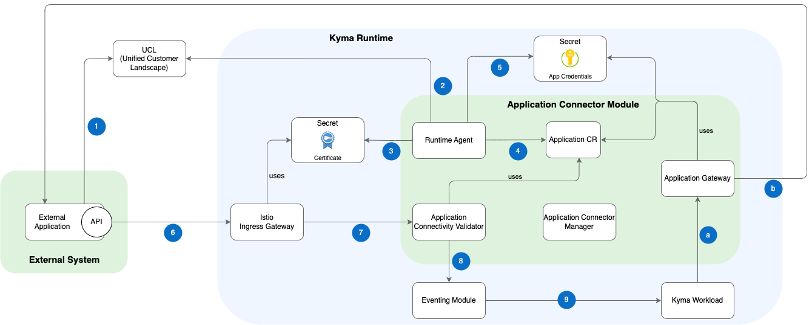

# Architecture

The following architectural diagram includes all components of the Application Connector module and describes the workflow for integrating an external system into Kyma using the different components.

## Components

|Component|Purpose|
|--|--|
|External application|An external system that interacts with your Kyma workload or is called by it.|
|Unified Customer Landscape (UCL)|The UCL system implements the SAP Extensibility concept and administrates system formations.|
|[Runtime Agent](./technical-reference/runtime-agent/README.md)|Runtime Agent is a client of the UCL system. It regularly synchronizes the defined system formations and integrates them into Kyma runtime.|
|Certificate Secret|Stores the UCL-managed certificates used for trusted communication between an external system and Kyma.|
|[Application custom resource (CR)](./resources/04-10-application.md)|Stores metadata of an external system (like endpoints, authentication method, etc.). Each Application CR corresponds to a single external system.|
|Application credentials Secret|Stores endpoint/API credentials of an external system.|
|[Istio Ingress Gateway](./technical-reference/02-10-istio-gateway.md)|The Application Connector module uses Istio Gateway as an endpoint for incoming requests from external systems. The Gateway supports mTLS for establishing trusted connections between an external system and Kyma runtime.|
|Application Connectivity Validator|Verifies incoming requests by analyzing the certificate subject and passes the request to the Kyma Eventing module.|
|[Eventing module](https://kyma-project.io/#/eventing-manager/user/README)|The Kyma Eventing module dispatches incoming requests from external systems to Kyma workloads.|
|Kyma workload|A user workload (for example, deployed applications) or any Kyma-hosted Serverless Function.|
|[Application Gateway](./technical-reference/02-20-application-gateway.md)|Acts as a proxy for outgoing communication from a Kyma workload to an external system. It supports various types of authentication methods.|
|Application Connector Manager|This Kubernetes Operator installs and configures all Application Connector module components in Kyma runtime. It manages the lifecycle of the Application Connector module based on the dedicated ApplicationConnector custom resource (CR).|

## Workflow

The diagram workflow shows the steps from registering an external system at UCL until it can interact with Kyma workloads. Some steps are only relevant when the integration of an external system is managed manually, but all of them are applied when the integration happens automatically using UCL.

<table>
    <tr>
        <th>Step</th>
        <th>Description</th>
        <th>Manual integration</th>
        <th>Integration by UCL</th>
    </tr>
    <tr>
        <td colspan="4"><strong>Inbound communciation</strong></td>
    </tr>
    <tr>
        <td>1</td>
        <td>An external system is registered in the UCL system and configured in the UCL system formation for Kyma runtime.</td>
        <td></td>
        <td>X</td>
    </tr>
    <tr>
        <td>2</td>
        <td>Runtime Agent connects to the UCL system and gathers all registered applications for this Kyma runtime.</td>
        <td></td>
        <td>X</td>
    </tr>
    <tr>
        <td>3</td>
        <td>The agent retrieves from UCL the cryptographical certificates used to secure communication between an external system and Kyma. The certificate is stored in a Kubernetes Secret.</td>
        <td></td>
        <td>X</td>
    </tr>
    <tr>
        <td>4</td>
        <td>Additionally, application metadata of an external system (for example, authentication type, API endpoints, etc.) are stored in an Application custom resource (CR).</td>
        <td>X This manual step is applied by an administrator</td>
        <td>X Step is automatically applied by Runtime Agent</td>
    </tr>
    <tr>
        <td>5</td>
        <td>Finally, Runtime Agent stores the credentials for accessing the API of an external system in a Kubernetes Secret.
These credentials are used for outbound communication proxied by the Application Gateway.</td>
        <td></td>
        <td>X</td>
    </tr>
    <tr>
        <td>6</td>
        <td>External systems communicate with Kyma runtime through the Istio Ingress Gateway.</td>
        <td>X</td>
        <td>X</td>
    </tr>
    <tr>
        <td>7</td>
        <td>Istio Gateway uses the provided certificate to secure communication using mTLS.</td>
        <td></td>
        <td>X</td>
    </tr>
    <tr>
        <td>8</td>
        <td>Incoming calls are verified by the Application Connectivity Validator by investigating the subject of the certificate. It finally forwards the request to the inbound handler of the Eventing module.</td>
        <td></td>
        <td>X</td>
    </tr>
    <tr>
        <td>9</td>
        <td>Kyma workloads can receive incoming events and process them.</td>
        <td>X</td>
        <td>X</td>
    </tr>
    <tr>
        <td colspan="4"><strong>Onbound communciation</strong></td>
    </tr>
    <tr>
        <td>a</td>
        <td>The Application Gateway acts as a proxy for any outbound communication from a Kyma workload to an external system API.</td>
        <td>X</td>
        <td>X</td>
    </tr>
    <tr>
        <td>b</td>
        <td>The Application Gateway handles security and authentication during the conversation with an external system API.</td>
        <td>X</td>
        <td>X</td>
    </tr>
</table>
