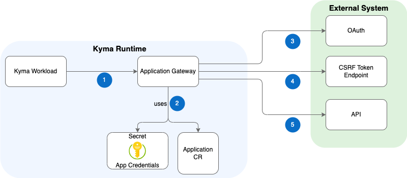

# Application Gateway

Application Gateway is an intermediary component between a Kyma workload and an external system. It proxies outgoing requests from Kyma to the external system API based on the configuration stored in the [Application](../resources/04-10-application.md) CR.

The following diagram illustrates how Application Gateway interacts with other modules and external APIs, which are either unsecured or secured with various security mechanisms and protected against cross-site request forgery (CSRF) attacks.

## Workflow

1. A Kyma workload calls Application Gateway which extracts the application name and the service name from the URL path.
2. Using the extracted application name, the gateway finds the corresponding Application CR and obtains the information about the registered external API, such as the API URL and security credentials.
3. Application Gateway gets a token from the OAuth server.
4. This step is optional and is valid only for the API which was registered with a CSRF token enabled: Application Gateway gets a CSRF token from the endpoint exposed by the upstream service.
5. Application Gateway calls the target API.

## Request Proxying

Application Gateway proxies the requests from Kyma workloads to external system APIs based on the configuration stored in the [Application CR](../resources/04-10-application.md) and Kubernetes Secrets.

For examples of configurations and credentials, see the [tutorial on registering a secured API](../tutorials/01-30-register-secured-api.md).

> [!NOTE]
> All APIs defined in a one Secret use the same configuration - the same credentials, CSRF tokens, and request parameters.

### Application Gateway URL

The URL a Kyma workload uses to proxy calls to an external system API always starts with `central-application-gateway.kyma-system`. The port and URL path define which application API is called.

Depending on whether the external system was integrated manually or automatically by UCL, the URL pattern looks different:

| **Integration** | **Application Gateway URL** |
|-----------|-------------------------|
| Manually | `http://central-application-gateway.kyma-system:8080/{APP_NAME}/{SERVICE_NAME}/{TARGET_PATH}` |
|      UCL | `http://central-application-gateway.kyma-system:8082/{APP_NAME}/{SERVICE_NAME}/{API_ENTRY_NAME}/{TARGET_PATH}` |

The placeholders in the URLs map to the following:

- `APP_NAME` is the name of the Application CR.
- `SERVICE_NAME` represents the API Definition.
- `TARGET_PATH` is the destination API URL.

### Handling of Headers

Application Gateway proxies the following headers while making calls to the external system:

- `X-Forwarded-Proto`
- `X-Forwarded-For`
- `X-Forwarded-Host`
- `X-Forwarded-Client-Cert`

In addition, the `User-Agent` header is set to an empty value not specified in the call, which prevents setting the default value.

### Response Rewriting

#### Redirects

Application Gateway performs response rewriting in situations when an external system responds to a redirect (`3xx` status code) that points to a URL with the same host but a different path:

The `Location` header is modified to replace the original target path with the Application Gateway URL and port. The sub-path pointing to the called service remains attached at the end.

The modified `Location` header has finally the following format:

`{APP_GATEWAY_URL}:{APP_GATEWAY_PORT}/{APP_NAME}/{SERVICE_NAME}/{SUB-PATH}`

This ensures that the calling Kyma workload also sends the redirected request through Application Gateway instead of starting direct communication with the external system. Passing authorization or custom headers, URL parameters, and the body works consistently.

#### 5xx Error Responses

Application Gateway also rewrites all the `5xx` status codes to `502`. In such a case, the `Target-System-Status` header contains the original code returned by the target.

## Supported API Authentication Methods

Application Gateway can call external system APIs which are not secured, or are secured by:

- [Basic Authentication](https://tools.ietf.org/html/rfc7617)
- [OAuth](https://tools.ietf.org/html/rfc6750)
- [OAuth 2.0 mTLS](https://datatracker.ietf.org/doc/html/rfc8705)
- Client certificates

> [!NOTE]
> Non-secured APIs are supported too, however, they are not recommended in the production environment.

Additionally, Application Gateway supports cross-site request forgery (CSRF) tokens as an optional layer of API protection.

Application Gateway calls the registered APIs accordingly, based on the security type specified for the API in the Application CR.

### Provide a Custom Access Token

Application Gateway overrides the registered API's security type if it gets a request that contains the `Access-Token` header. In such a case, Application Gateway rewrites the token from the `Access-Token` header into an OAuth-compliant `Authorization` header and forwards it to the target API.

This mechanism is suited for implementations in which an external application handles user authentication:

If the user is already authenticated to the target API, the access token can be passed in a custom `Access-token` header. The header's value is of the `Bearer {TOKEN}` or `Basic {TOKEN}` form. If the Application Gateway service detects that the custom header is present, instead of performing authentication steps, it removes the `Access-token` header and passes the received value in the `Authorization` header.

### Token Caching

To ensure optimal performance, Application Gateway caches the OAuth tokens and CSRF tokens it obtains. If the service doesn't find valid tokens for the call it makes, it gets new tokens from the OAuth server and the CSRF token endpoint.
Additionally, the service caches ReverseProxy objects used to proxy requests to the underlying URL.
