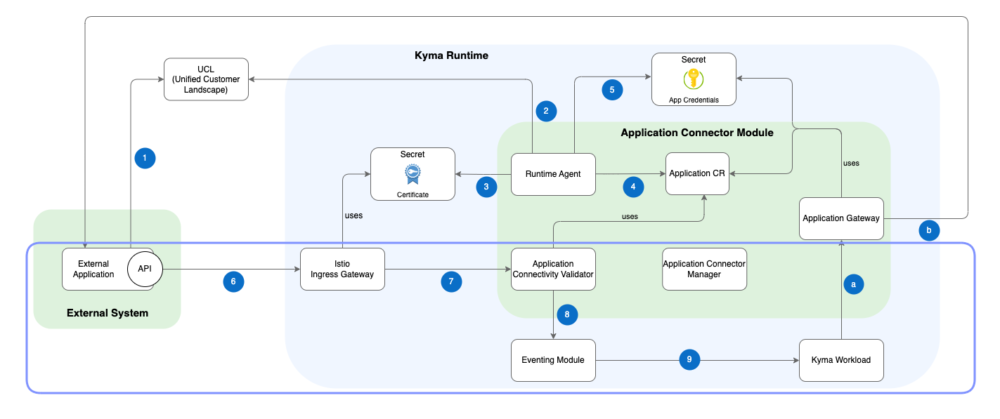

# Application Connectivity Validator

Application Connectivity Validator is an intermediary component processing incoming events from a connected external system.

It verifies incoming requests for all connected external systems by comparing the certificate subjects with the registered applications. If the subject matches an application name, the request is accepted and the validator passes it to the Kyma Eventing module.

The following diagram shows how Application Connectivity Validator service interacts with other Kyma modules and an external system, within Application Connector components.

## Workflow
1. An external system sends an event to Kyma with the mTLS protocol using a certificate issued for the application.
2. Istio Ingress Gateway verifies the client certificate, following the mTLS protocol, allows for connection, and proxies the event to Application Connectivity Validator.
3. Application Connectivity Validator verifies if the subject of a client certificate attached to the event matches the application name.
4. Application Connectivity Validator forwards the request to the Eventing Module.
5. The Eventing module proxies the event to the Kyma workload subscribed to the event.

> [!NOTE]
> The Application Connectivity Validator requires Istio Ingress Gateway. Therefore, to use the Application Connectivity Validator, you must enable the Istio module. For more information, see [Istio Ingress Gateway](02-10-istio-gateway.md)