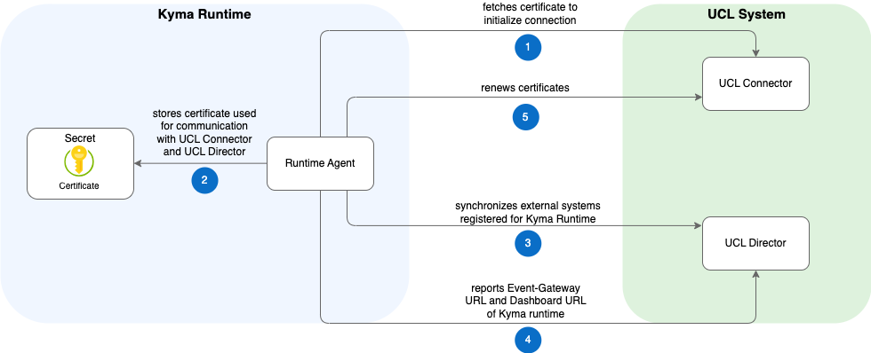

# Runtime Agent

Runtime Agent acts as a client for UCL (Unified Customer Landscape). Its purpose is to integrate external systems, registered for Kyma in UCL, into Kyma runtime.

Its responsibilities are:

- Regularly synchronizing external systems (so-called `Applications` in UCL) over the UCL Director by fetching new Applications from the Director and integrating them into Kyma or removing those that no longer exist.

- Establishing (or renewing) a trusted connection between Kyma runtime and the UCL services.
- Enable bidirectional communication between external systems and Kyma runtimes by uploading the Kyma runtime configuration (for example, the Event Gateway URL) to the UCL backend. UCL shares this data with the external application. To learn more, read the section on [configuring the Runtime](./03-20-configuring-runtime.md).

## Architecture

The diagram illustrates the workflow of Runtime Agent and the involved components.

### Components

|Component|Purpose|
|--|--|
|Runtime Agent|Client of the UCL system, which integrates and synchronizes external applications with Kyma runtime. It also ensures trusted communication with the UCL services by exchanging certificates.|
|[UCL Connector](https://github.com/kyma-incubator/compass/blob/main/docs/connector/02-01-connector-service.md)|Connector establishes trust between external systems and runtimes.|
|[UCL Director](https://github.com/kyma-incubator/compass/blob/master/docs/compass/02-01-components.md#director)|The UCL Director handles the process of managing external systems and runtimes.|
|Certificate Secret|Stores the certificate used by Runtime Agent to establish a trusted connection with a UCL service|

### Workflow

1. The Runtime Agent fetches the certificate from the UCL Connector to initialize the connection with the UCL system.
2. The certificate and key for the UCL Connector and the UCL Director are stored in a Kubernetes Secret.
3. The agent synchronizes the Kyma-integrated external systems with the UCL Director by:
    * Fetching new external systems from the UCL Director and creating them in Kyma runtime
    * Removing from Kyma runtime the external systems that no longer exist in the UCL Director.
4. It reports the Event Gateway URL and the Dashboard URL of Kyma runtime to the UCL Director. These URLs are also displayed in the UCL UI.
5. Regular renewal of the certificate (used for the UCL Connector and the UCL Director communication) is applied. This happens when the remaining validity for the certificate exceeds a certain threshold.

## Useful Links

If you're interested in learning more about Runtime Agent, see the following links:

- [Tutorials](./tutorials/README.md) for Application Connectivity
- Find out more details about the [CompassConnection](../../resources/04-20-compassconnection.md) custom resource (CR) for UCL (mind that, for historical reasons, UCL was previously called Compass and the CR is still named `CompassConnection`)
- Learn how the [connection to UCL](./03-10-ucl-connection.md) is established
- Understand how Runtime Agent [configures runtimes](./03-20-configuring-runtime.md)
