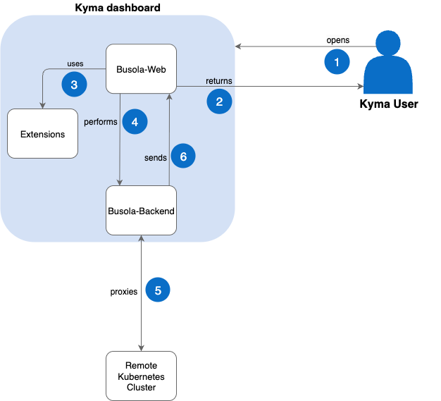

# Kyma Dashboard

Use Kyma dashboard to access various features and functionalities of Kyma runtime.

Kyma dashboard is a web-based UI utilizing the React library and the SAP Fiori Horizon design system. It works on top of the [Busola UI](https://github.com/kyma-project/busola) and provides basic configuration for different environments (including extensions, authorization, and feature flags) for Kyma clusters. Kyma uses Kyma dashboard as a central administration dashboard, which provides a graphical overview of your cluster and all its resources.

You can also use Kyma dashboard as a standalone dashboard for managing Kubernetes clusters.

## Features

You can use Kyma dashboard to perform the following actions:

- Add, manage, and delete Kyma modules.
- Manage your namespaces.
- Manage your Kubernetes and Kyma resources.
- Generate access tokens based on service accounts and Kubernetes RoleBindings and ClusterRoleBindings, which regulate access using role-based access control (RBAC).
- Have a quick look at the basic cluster condition.

  

  ## Architecture

  

1. The user opens Kyma dashboard in a web browser.
2. Busola returns all elements required to run the Kyma dashboard web application (scripts, HTML, styles, and images) in a user web browser.
3. Busola uses Kyma dashboard extensions to run Kyma components.
4. User performs operations using Kyma dashboard on a remote Kubernetes cluster by providing cluster connection details. These are typical Kubernetes CRUD operations.
5. Busola backend proxies operations to a remote Kubernetes cluster.
6. The backend sends back a response to Kyma dashboard, which displays the returned information.

## Related Information

- [Command Palette feature](../user/01-20-command-palette.md)
