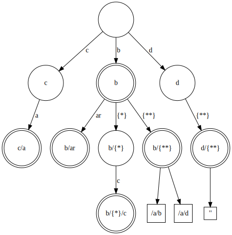

# Path Conflict Validation in APIRules `v2alpha1` and `v2`

APIRules `v2alpha1` and `v2` introduce support for wildcard paths in the **path** field of the APIRule CustomResourceDefinition. 
This allows you to define a single APIRule that matches multiple request paths.
However, this also introduces the possibility of path conflicts. 
A path conflict occurs when two or more APIRule resources match the same path.

To prevent path conflicts, API Gateway Operator validates the paths of all APIRule resources in the cluster.
To make sure that the structure supports wildcard paths, the operator uses an algorithm implemented with a modified version of the `trie` data structure,
defined in the `internal/path/segment_trie.go` file.

Stored paths can contain the `{*}` and `{**}` operators:
  - The operator `{*}` is used to match a single segment in a path and may include a prefix and/or suffix.
  - The operator `{**}` is used to match any number of segments in a path and may include a prefix and/or suffix.
    It must be the last operator in the stored path (this is not validated here but is assumed to be true).

The modified trie algorithm performs two actions that are not included in the regular version:
  - Nodes that are pointed to by `{**}` don't store their children.
    Instead, they store the path suffix that exists after `{**}`.
    Possible paths are found by comparing the suffixes of paths with the same segments that precede `{**}`.
    In case there is no suffix after `{**}`, the node stores `""` as the suffix.
    New paths starting with the same pattern before `{**}` are stored in the same node, and the suffix list is updated.
    This can be done since the `{**}` operator must be the last operator in any path.
  - `{*}` nodes are stored just like any other exact segment node but are always included in path search.

During insertion, the trie is first traversed to detect collisions: literal and `{*}` nodes are
matched segment by segment, and any `{**}` node checks its stored suffixes against the remaining
path to catch overlapping multi-segment matches. If any path that is already in the trie matches the new
token sequence under these rules, insertion fails with a collision error.

See the diagram, which illustrates an example data structure generated from the following paths:
- `"c/a"`
- `"b/ar"`
- `"b/{*}"`
- `"b/{*}/c"`
- `"b/{**}/a/b"`
- `"b/{**}/a/d"`
- `"d/{**}"`

Nodes marked with a double circle can be the end of a path (have the boolean flag `EndNode==true`).
Square nodes represent suffixes stored in the `{**}` operator nodes
(they are not an actual node in the trie).

## Validation Process

The validation process is performed during the creation of the `trie` data structure.
Before any `path` is added to the `trie`, the operator checks if an existing path in the `trie` is a prefix of the new path.

If no conflict is found, the new path is added to the `trie`, and the process continues with the next path.

### Exact Path Validation

In the simplest case, where a conflict is checked between the paths already stored in the `trie` and a new exact path, 
the path search algorithm takes into account the following possible cases:
1. The current search node is a `literal` node - not an operator.
2. The current search node is a `{*}` node.
3. The current search node is a `{**}` node.

In the first case, the algorithm checks if the current segment is equal to the currently checked segment in the path.
If so, the search continues recursively with the next segment in the path.

In the second case, the algorithm does not need to check the current segment, as the `{*}` operator matches any segment.
The search continues recursively with the next segment in the path.

If the third case occurs, and the current segment is a `{**}` operator, the algorithm checks if the path ends with any of the suffixes stored in the current node.
The suffix search is performed from the segment that has the same index as the current segment in the checked exact path.
If the suffix is found, the algorithm concludes that the paths conflict.

Example: If the path that is currently being inserted is `/a/b/c`, and a path `/a/{**}` exists in the trie, the `{**}` suffixes are analysed if those conflict with the `/c` suffix.

If the search did not finish in any of the cases above, the algorithm continues until there are no more segments in the checked path.
Then, the algorithm checks if the current node is a possible end of the path. In the previously presented graph, those nodes are marked with a double circle.

### Paths that Contain the `{*}` Operator

In case the path that is currently being inserted contains the `{*}` operator,
the algorithm performs the check similarly to the exact path validation, as the order of **rule.paths** is significant. Paths should be listed from the most specific to the most general.

Example: If the path that is currently being inserted is `/b/{*}/a/b`, the algorithm checks if the same path exists in the trie.

### Paths that Contains the `{**}` Operator

In case the path that is currently being inserted contains the `{**}` operator,
the algorithm is interrupted after the `{**}` operator is found (as it must be the last operator in the path).
Then, the algorithm checks if there are any paths that end in the same suffix as the currently checked path.

Example: If the path that is currently being inserted is `/b/{**}/a/b`, the algorithm checks if any path after the `b` node ends in `/a/b` or is empty. For example, if a path like `/b/{**}` already exists in the trie.

<!---
DOT source for the trie diagram:

digraph Trie {
    node [shape=circle, width=1];

    "" -> "c" [label="c"];
    "" -> "b" [label=" b"];
    "" -> "d" [label="d"];

    "c" -> "c/a" [label="a"];
    
    "c/a" [shape=doublecircle];

    "b" -> "b/ar" [label="ar"];
    "b" -> "b/{*}" [label=" {*}"];
    "b/{*}" -> "b/{*}/c" [label=" c"];
    "b" -> "b/{**}" [label="{**}"];
    
    "b/{**}" -> "/a/b"
    "b/{**}" -> "/a/d"
    
    "/a/b" [shape=square,width=0.2]
    "/a/d" [shape=square,width=0.2]

    "b" [shape=doublecircle];
    "b/{*}/c" [shape=doublecircle];
    "b/ar" [shape=doublecircle];
    "b/{**}" [shape=doublecircle];
    
    "d" -> "d/{**}" [label="{**}"];
    
    "d/{**}" [shape=doublecircle];
    "d/{**}" -> "end"
    
    "end" [label="''", shape=square,width=0.2]
}
-->
