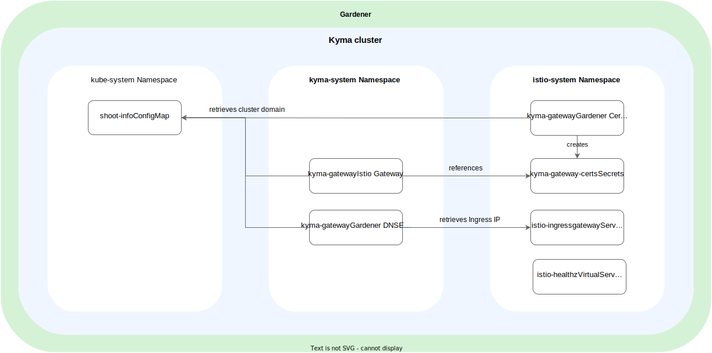
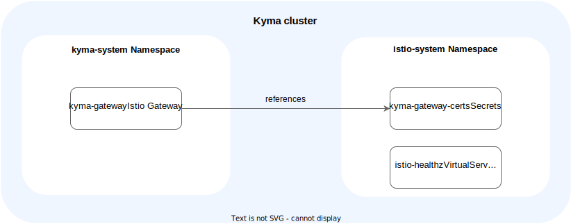

# APIGateway Kyma Gateway

Kyma Gateway is an [Istio Gateway CR](https://istio.io/latest/docs/reference/config/networking/gateway/) named `kyma-gateway` that is located in the `kyma-system` namespace. Istio Gateway describes which ports and protocols should be exposed for a particular domain.
The configuration of Kyma Gateway varies depending on whether you use a managed SAP BTP, Kyma runtime cluster, or an open-source Kyma cluster.

## SAP BTP, Kyma Runtime
In a managed SAP BTP, Kyma runtime cluster, Kyma Gateway uses the Gardener Shoot domain. For this domain, an Istio Gateway CR exposes the HTTPS port (`443`) and the HTTP port (`80`) with a redirect to port `443`.
Istio Gateway uses a certificate managed by a [Gardener Certificate CR](https://gardener.cloud/docs/guides/networking/certificate-extension#using-the-custom-certificate-resource).
The Gardener [DNSEntry CR](https://gardener.cloud/docs/guides/networking/DNS-extension#creating-a-dnsentry-resource-explicitly) creates a DNS record for the specified domain with the Istio Ingress Gateway Load Balancer Service as the target.
Furthermore, an Istio Virtual Service is created, which exposes the Istio readiness endpoint at `healthz.{GARDENER_SHOOT_DOMAIN}/healthz/ready`.

## Open-Source Kyma
In an open-source Kyma cluster, Kyma Gateway uses the domain `local.kyma.dev`. For this domain, an Istio Gateway CR exposes the HTTPS port (`443`) and the HTTP port (`80`) with a redirect to port `443`.
Istio Gateway uses a default certificate for the domain `local.kyma.dev` that is valid until July 2030.
Furthermore, an Istio Virtual Service is created, which exposes the Istio readiness endpoint at `healthz.local.kyma.dev/healthz/ready`.

## Disable or Enable Kyma Gateway
By default, Kyma Gateway is enabled. You can disable it by removing the `enableKymaGateway` field in the [APIGateway CR](./04-00-apigateway-custom-resource.md) or setting it to `false`.
Kyma Gateway can be disabled only if no APIRules are configured in the cluster.
