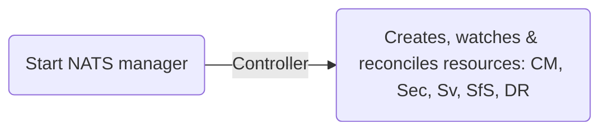
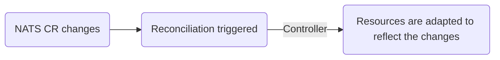
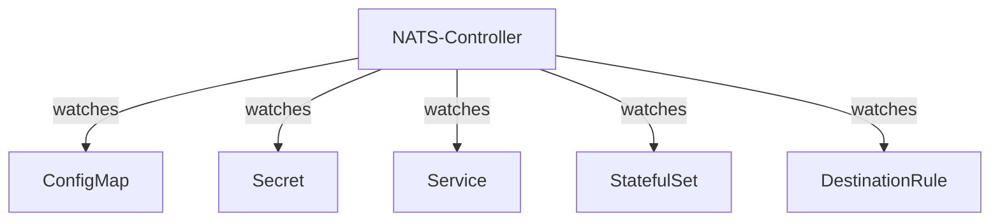
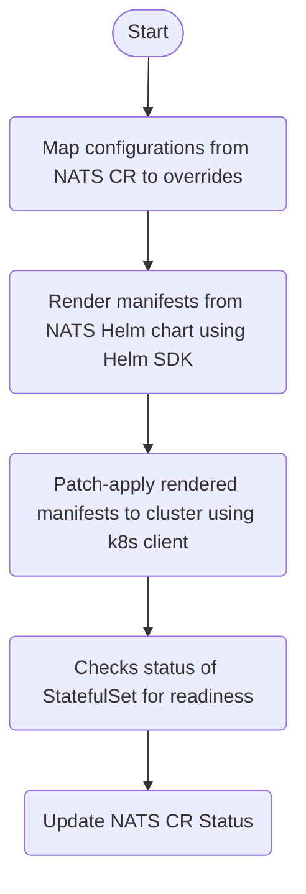

# Summary: NATS Manager Flow Charts

## NATS Manager is started

## NATS Manager reacts to NATS CR changes

## NATS Manager reacts to resource changes

## Overview: NATS Manager watches resources

## Overview: Reconciliation Flow

