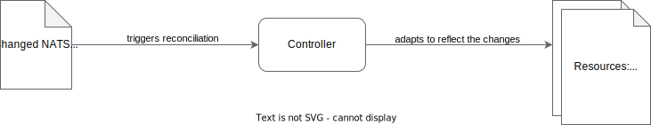
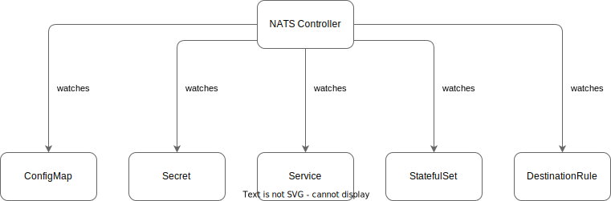

# NATS Manager

The Kyma NATS module ships the NATS Manager.

## Module Lifecycle

### Starting NATS Manager

Upon starting the NATS Manager, the controller (following the [Kubebuilder concept](https://book.kubebuilder.io/architecture.html)) creates, watches, and reconciles the following resources:

- ConfigMap (cm)
- Secret (sc)
- Service (sv)
- Stateful Set (sts)
- DestinationRule (dr, [Istio](https://istio.io))

### Reacting to NATS CR Changes

The NATS Manager reacts to changes of the NATS CR to adapt the resources mentioned above to the desired state.
For details how to configure NATS using the CR, visit the [Configuration documentation](./02-configuration.md).

### Reacting to Resource Changes

When resources are changed or deleted, the controller reacts by restoring the defaults according to the NATS CR.
Thus, if you want to change the resources, you must edit the NATS CR; you cannot change the resources directly.

### Overview: NATS Manager Watches Resources

  
