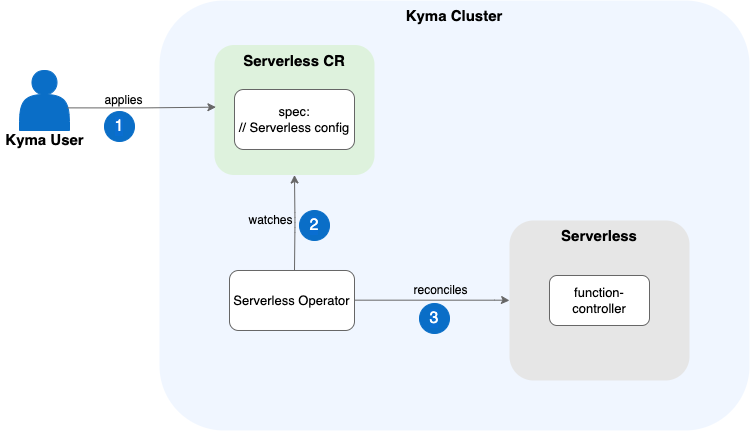

# Serverless Module

Learn more about the Serverless module. Use it to run lightweight Functions in a cost-efficient and scalable way using JavaScript and Node.js.

## What Is Serverless?

The Kyma Serverless module is a "code-as-a-service" tool designed to accelerate the process of prototyping applications by removing the technical overhead necessary to obtain the first testable versions. It allows developers to focus on the coding and easily run it in the context of the SAP BTP without dealing with Kubernetes orchestration or containerization complexities. The fact that no Kubernetes knowledge is required to use it makes Serverless a useful tool for beginners who want to experiment with loosely coupled microservice architecture on Kubernetes or for business consultants who need to provide extension logic for an existing Kubernetes-based system with minimal overhead.

With the Serverless module, you can build, run, and manage serverless applications in Kubernetes. These applications are called Functions, and they are based on the [Function custom resource (CR)](https://kyma-project.io/#/serverless-manager/user/resources/06-10-function-cr) objects. They contain simple code snippets that implement a specific business logic. For example, you can define that you want to use a Function as a proxy that saves all incoming event details to an external database.

A Function can be triggered by other workloads in the cluster (in-cluster events) or business events coming from external sources. You can subscribe to them using a [Subscription CR](https://kyma-project.io/#/eventing-manager/user/resources/evnt-cr-subscription). You can expose your Function to an external endpoint (HTTPS). With an [APIRule CR](https://kyma-project.io/#/api-gateway/user/custom-resources/apirule/04-10-apirule-custom-resource), you can define who can reach the endpoint and what operations they can perform on it.

## Features

The Serverless module provides the following features:

- Quick deployments following a Function approach
- Loosely coupled microservice approach
- Event-driven programming model
- Reduced implementation and operation effort
- Function management with Kubernetes resources like [Deployments](https://kubernetes.io/docs/concepts/workloads/controllers/deployment/), [Services](https://kubernetes.io/docs/concepts/services-networking/service/), and [HorizontalPodAutoscalers](https://kubernetes.io/docs/tasks/run-application/horizontal-pod-autoscale/)
- Docker image creation with [Kubernetes Jobs](https://kubernetes.io/docs/concepts/workloads/controllers/job/)

## Architecture

1. User applies the Serverless CR.
2. Serverless Operator watches the Serverless CR.
3. Serverless Operator reconciles the Serverless workloads.

### Serverless Operator

When you add the Serverless module, Serverless Operator takes care of installation and configuration of Serverless in your cluster. It manages the Serverless lifecycle based on the dedicated Serverless CR.

## API/Custom Resource Definitions

The API of the Serverless module is based on Kubernetes CustomResourceDefinitions (CRDs), which extend the Kubernetes API with custom additions. To inspect the specification of the Serverless module API, see:

- [Function CRD](https://kyma-project.io/#/serverless-manager/user/resources/06-10-function-cr)
- [Serverless CRD](https://kyma-project.io/#/serverless-manager/user/resources/06-20-serverless-cr)

## Security Considerations

To learn how to avoid any potential threats while using Functions, see [Function Security](00-40-security-considerations.md).

## Resource Consumption

To learn more about the resources used by the Serverless module, [see Kyma Modules' Sizing](https://help.sap.com/docs/btp/sap-business-technology-platform/kyma-modules-sizing?locale=en-US#loio3a924906857b4f01969cb684ccd25309__section_serverless).

## Related Information

- [Function Security](00-40-security-considerations.md)
- [Serverless module tutorials](tutorials/README.md)
- [Serverless module technical reference](technical-reference/README.md)
- [Serverless module troubleshooting guides](troubleshooting-guides/README.md)
