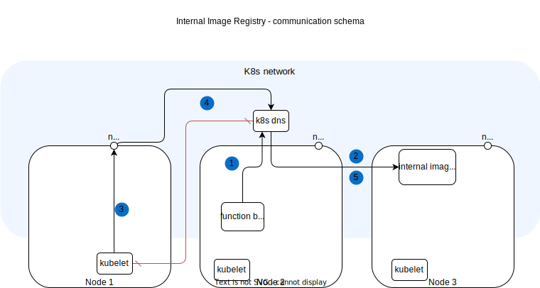

# Internal Docker Registry

By default, the Kyma Serverless module comes with the internal Docker registry, which stores the Function container images without using the third-party registry.

The internal Docker registry is not recommended for production, as it's not deployed in the High Availability (HA) setup and has limited storage space and no garbage collection of the orphaned images.

Still, it is very convenient for development and getting first-time experience with Kyma Serverless.

See the following diagram to learn how it works:

1. Build job pushes the Function image to the Docker registry using the in-cluster URL.
2. The Kubernetes DNS resolves the internal Docker registry URL to the actual IP address.
3. [kubelet](https://kubernetes.io/docs/reference/command-line-tools-reference/kubelet/) fetches the image using the URL: `localhost:{node_port}/{image}`.
4. NodePort allows kubelet to get into the cluster network, translate `localhost` to `internal-registry.kyma-system.svc.cluster.local`, and ask the Kubernetes DNS to resolve the name.
5. The Kubernetes DNS service resolves the name and provides the IP of the internal Docker registry.

> [!NOTE]
> kubelet cannot resolve the in-cluster URL. That's why Serverless uses the NodePort service.

The NodePort service routing assures that the pull request reaches the internal Docker registry regardless of whether it is from a different node.
