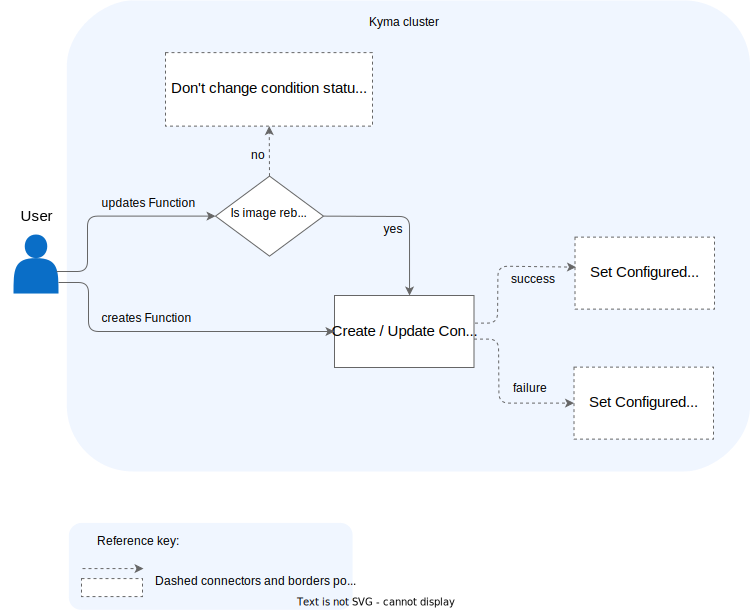
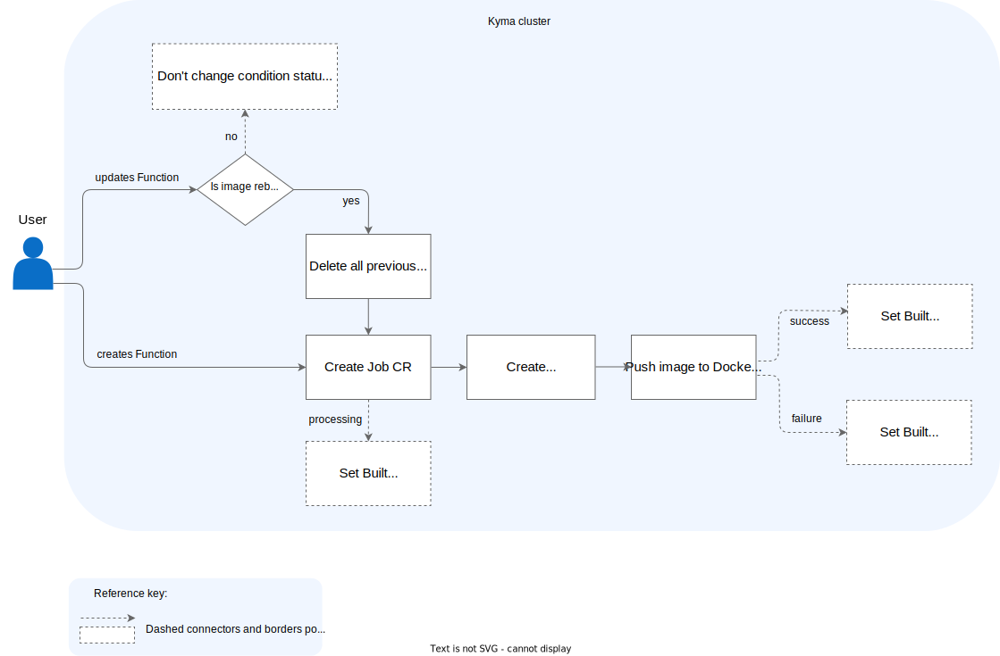
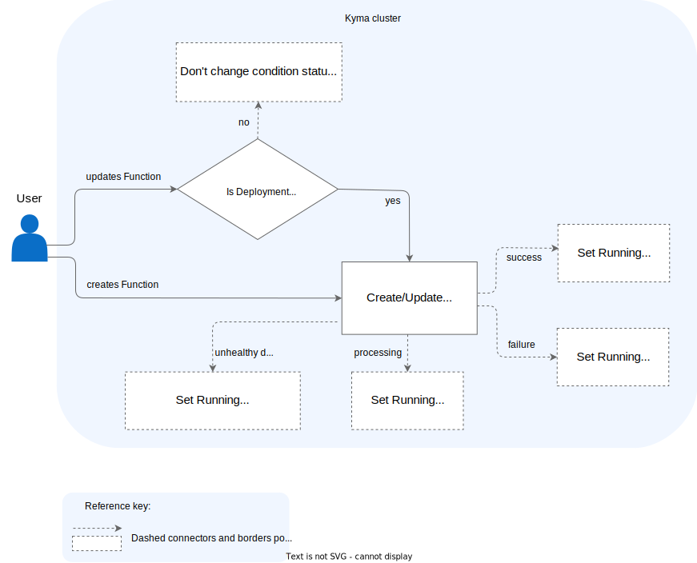

# Function Processing Stages

From the moment you [create a Function](../tutorials/01-10-create-inline-function.md) (Function CR) until the time it is ready, it goes through three processing stages that are defined as these condition types:

1. `ConfigurationReady` (PrinterColumn `CONFIGURED`)
2. `BuildReady` (PrinterColumn `BUILT`)
3. `Running` (PrinterColumn `RUNNING`)

For a Function to be considered ready, the status of all three conditions must be `True`:  

```bash
NAME            CONFIGURED   BUILT     RUNNING   RUNTIME    VERSION   AGE
test-function   True         True      True      nodejs20   1         96s
```

When you update an existing Function, conditions change asynchronously depending on the change type.  

The diagrams illustrate all three core status changes in the Function processing circle that the Function Controller handles. They also list all custom resources involved in this process and specify in which cases their update is required.

> [!NOTE]
> Before you start reading, see the [Function CR](../resources/06-10-function-cr.md) document for the custom resource detailed definition, the list of all Function's condition types, and reasons for their success or failure.

## Configured

This initial phase starts when you create a Function CR with configuration specifying the Function's setup. It ends with creating a ConfigMap that is used as a building block for a Function image.



## Built

This phase involves creating and processing the Job CR. It ends successfully when the Function image is built and sent to the Docker registry. If the image already exists and only an update is required, the Docker image receives a new tag.

Updating an existing Function requires an image rebuild only if you change the Function's body (**source**) or dependencies (**deps**). An update of a Function's other configuration details, such as environment variables, replicas, resources, or labels, does not require image rebuild because it only affects the Deployment.

> [!NOTE]
> Each time you update a Function's configuration, the Function Controller deletes all previous Job CRs for the given Function's **UID**.



## Running

This stage revolves around creating a Deployment, Service and HorizontalPodAutoscaler or updating them when configuration changes were made in the Function CR or the Function image was rebuilt.

In general, the Deployment is considered updated when both configuration and the image tag in the Deployment are up to date. Service and HorizontalPodAutoscaler are considered updated when there are proper labels set and configuration is up to date.

Thanks to the implemented reconciliation loop, the Function Controller constantly observes all newly created or updated resources. If it detects changes, it fetches the appropriate resource's status and only then updates the Function's status.

The Function Controller observes the status of the underlying Deployment. If the minimum availability condition for the replicas is not satisfied, the Function Controller sets the **Running** status to `Unknown` with reason `MinimumReplicasUnavailable`. Such a Function should be considered unhealthy and the runtime profile or number of Replicas must be adjusted.


