# Integrate With Jaeger

## Overview

| Category| |
| - | - |
| Signal types | traces |
| Backend type | custom in-cluster |
| OTLP-native | yes |

Learn how to use [Jaeger](https://github.com/jaegertracing/helm-charts/tree/main/charts/jaeger) as a tracing backend with Kyma's [TracePipeline](../../03-traces.md).



## Table of Content

- [Prerequisites](#prerequisites)
- [Installation](#installation)
- [Advanced Topics](#advanced-topics)

## Prerequisites

- Kyma as the target deployment environment
- The [Telemetry module](../../README.md) is [added](https://kyma-project.io/#/02-get-started/01-quick-install)
- [Kubectl version that is within one minor version (older or newer) of `kube-apiserver`](https://kubernetes.io/releases/version-skew-policy/#kubectl)
- Helm 3.x

## Installation

### Preparation

1. Export your namespace as a variable with the following command:

    ```bash
    export K8S_NAMESPACE="jaeger"
    ```

1. Export the Helm release name that you want to use. The release name must be unique for the chosen Namespace. Be aware that all resources in the cluster will be prefixed with that name. Run the following command:

    ```bash
    export HELM_JAEGER_RELEASE="jaeger"
    ```

1. Update your Helm installation with the required Helm repository:

    ```bash
    helm repo add jaegertracing https://jaegertracing.github.io/helm-charts
    helm repo update
    ```

### Install Jaeger

> [!NOTE]
> It is officially recommended to install Jaeger with the [Jaeger operator](https://github.com/jaegertracing/helm-charts/tree/main/charts/jaeger-operator). Because the operator requires a cert-manager to be installed, the following instructions use a plain Jaeger installation. However, the described installation is not meant to be used for production setups.

Run the Helm upgrade command, which installs the chart if not present yet.

```bash
helm upgrade --install --create-namespace -n $K8S_NAMESPACE $HELM_JAEGER_RELEASE jaegertracing/jaeger -f https://raw.githubusercontent.com/kyma-project/telemetry-manager/main/docs/user/integration/jaeger/values.yaml
```

The previous command uses the [values.yaml](https://raw.githubusercontent.com/kyma-project/telemetry-manager/main/docs/user/integration/jaeger/values.yaml) provided in this `jaeger` folder, which contains customized settings deviating from the default settings. Alternatively, you can create your own `values.yaml` file and adjust the command.

### Verify the Installation

Check if the `jaeger` Pod was successfully created in the Namespace and is in the `Running` state:

```bash
kubectl -n $K8S_NAMESPACE rollout status deploy $HELM_JAEGER_RELEASE
```

### Activate a TracePipeline

To configure the Kyma trace gateway with the deployed Jaeger instance as the backend. To create a new [TracePipeline](../../03-traces.md), execute the following command:

```bash
cat <<EOF | kubectl -n $K8S_NAMESPACE apply -f -
apiVersion: telemetry.kyma-project.io/v1alpha1
kind: TracePipeline
metadata:
  name: jaeger
spec:
  output:
    otlp:
      protocol: http
      endpoint:
        value: http://$HELM_JAEGER_RELEASE-collector.$K8S_NAMESPACE.svc.cluster.local:4318
EOF
```
  
### Activate Istio Tracing

To [enable Istio](../../03-traces.md#2-enable-istio-tracing) to report span data, apply an Istio telemetry resource and set the sampling rate to 100%. This approach is not recommended for production.

```bash
cat <<EOF | kubectl apply -f -
apiVersion: telemetry.istio.io/v1
kind: Telemetry
metadata:
  name: tracing-default
  namespace: istio-system
spec:
  tracing:
  - providers:
    - name: "kyma-traces"
    randomSamplingPercentage: 100.00
EOF
```

### Access Jaeger

1. To access Jaeger using port forwarding, run:

   ```bash
   kubectl -n $K8S_NAMESPACE port-forward svc/$HELM_JAEGER_RELEASE-query 16686
   ```

2. Open the Jaeger UI in your browser under `http://localhost:16686`.

### Deploy a Workload and Activate Kyma’s TracePipeline Feature

To see distributed traces visualized in Jaeger, follow the instructions for the [sample app](../sample-app/README.md) or the [OpenTelemetry Demo App](../opentelemetry-demo/README.md).

## Advanced Topics

### Integrate With Grafana

Jaeger can be provided as a data source integrated into Grafana. For example, it can be part of a Grafana installation as described in the [Prometheus integration guide](./../prometheus/README.md).

1. To have a Jaeger data source as part of the Grafana installation, deploy a Grafana data source in the following way:

    ```bash
    cat <<EOF | kubectl -n $K8S_NAMESPACE apply -f -
    apiVersion: v1
    kind: ConfigMap
    metadata:
      name: jaeger-grafana-datasource
      labels:
        grafana_datasource: "1"
    data:
        jaeger-grafana-datasource.yaml: |-
          apiVersion: 1
          datasources:
          - name: Jaeger-Tracing
            type: jaeger
            access: proxy
            url: http://$HELM_JAEGER_RELEASE-query.$K8S_NAMESPACE:16686
            editable: true
    EOF
    ```

2. Restart the Grafana instance. Afterwards, the Jaeger data source is available in the `Explore` view.

### Authentication

By itself, Jaeger does not provide authentication mechanisms. To secure Jaeger, follow the instructions provided in the [Jaeger documentation](https://www.jaegertracing.io/docs/2.0/faq/#how-do-i-configure-authentication-for-jaeger-ui).

### Expose Jaeger

>**CAUTION**: The following approach exposes the Jaeger instance as it is, without providing any ways of authentication.

1. To expose Jaeger using Kyma API Gateway, create the following APIRule:

    ```bash
    cat <<EOF | kubectl -n $K8S_NAMESPACE apply -f -
    apiVersion: gateway.kyma-project.io/v1beta1
    kind: APIRule
    metadata:
      name: jaeger
    spec:
      host: jaeger-ui
      service:
        name: $HELM_JAEGER_RELEASE-query
        port: 16686
      gateway: kyma-system/kyma-gateway
      rules:
        - path: /.*
          methods: ["GET", "POST"]
          accessStrategies:
            - handler: noop
          mutators:
            - handler: noop
    EOF
    ```

2. Get the public URL of your Jaeger instance:

    ```bash
    kubectl -n $K8S_NAMESPACE get vs -l apirule.gateway.kyma-project.io/v1beta1=jaeger.$K8S_NAMESPACE -ojsonpath='{.items[*].spec.hosts[*]}'
    ```

## Clean Up

When you're done, remove the example and all its resources from the cluster.

1. Remove the stack by calling Helm:

    ```bash
    helm delete -n $K8S_NAMESPACE $HELM_JAEGER_RELEASE
    ```

2. If you created the `$K8S_NAMESPACE` Namespace specifically for this tutorial, remove the Namespace:

    ```bash
    kubectl delete namespace $K8S_NAMESPACE
    ```
