# Integrate Custom Instrumentation App

## Overview

| Category| |
| - | - |
| Signal types | traces, metrics, logs |
| Backend type | custom in-cluster, third-party remote |
| OTLP-native | yes |

Learn how to instrument your custom Golang application using the [OTel SDK](https://opentelemetry.io/docs/languages/) and how to export metrics and trace data using the OTel SDK. You learn to configure the sample application to push trace and metric data using OTLP to the collector that's provided by Kyma, so that they are collected together with the related Istio trace data.

For examples using the OTel SDK in a different language, refer to the official [OTel guides](https://opentelemetry.io/docs/languages/) and the [OTel demo app](./../opentelemetry-demo/).



## Prerequisites

- Kyma as the target deployment environment.
- The [Telemetry module](../../README.md) is [added](https://kyma-project.io/#/02-get-started/01-quick-install).

- [Kubectl version that is within one minor version (older or newer) of `kube-apiserver`](https://kubernetes.io/releases/version-skew-policy/#kubectl).

## Exploring the Sample App

The sample app is a small webserver written in Golang, which exposes two endpoints `forward` and `terminate`. When calling the endpoints via HTTP, metrics are counted up and spans are emitted using OTLP exporters. Furthermore, structured logs are written to `stdout`.

The application is located in the [`telemetry-manager`](https://github.com/kyma-project/telemetry-manager/tree/main/dependencies/sample-app) repository.

### Setup

The application consists of the following Go files:

- `main.go`
  - the main method with the handler routines
  - the initialization of the tracer and meter provider including the metric definitions
  - auto-instrumentation of the handler routines using the OTel SDK
- `setup.go`
  - the setup of the tracer and meter providers using the OTel SDK
  - configuration for either the OTLP GRPC exporters or a console exporter

### Metrics

- The `init` method defines the available metrics:
  - `cpu.temperature.celsius` is a Gauge that is updated constantly using an observable.
  - `hd.errors` is a Counter that is increased on every `terminate` handler call.
  - `cpu.energy.watt` is a Histogram that is increased in one bucket on every `terminate` handler call.
- The `main` method initializes and registers the MeterProvider.
- In the `main` method, the handler functions are auto-instrumented using the [`otelhttp`](https://pkg.go.dev/go.opentelemetry.io/contrib/instrumentation/net/http/otelhttp) library, having request metrics auto-instrumented starting with `http.server.request`.

### Traces

- The `main` method initializes a tracer and a propagator.
- In the handler routines, the tracer is used to create new spans.
- The propagation in the `forward` method happens automatically by passing the request context to the upstream call.
- In the `main` method, the handler functions are auto-instrumented using the [`otelhttp`](https://pkg.go.dev/go.opentelemetry.io/contrib/instrumentation/net/http/otelhttp) library, having request spans auto-instrumented that have span names prefixed with `auto-`.

### Logs

The `main.go` file initializes the Golang `slog` logger, which is consistently used for all application logs. It is configured to print in JSON and if it's available, the logs add the traceId attribute.

### Running local

By default, the exporters are configured to print to stdout, so that you can run the app from local.

1. Checkout the `telemetry-manager` repo and go to the folder `dependencies/sample-app`.

1. Build and start the application:

    ```sh
    make run
    ```

## Deploying the Sample App

### Activate Kyma Telemetry with a backend

1. Provide a tracing backend and activate it.
   Install [Jaeger in-cluster](../jaeger/README.md) or provide a custom backend supporting the OTLP protocol (like [SAP Cloud Logging](./../sap-cloud-logging/)).
1. Provide a metric backend and activate it.
   Install [Prometheus in-cluster](../prometheus/README.md) or provide a custom backend supporting the OTLP protocol (like [SAP Cloud Logging](./../sap-cloud-logging/)).
1. Provide a log backend and activate it.
   Install [Loki in-cluster](../loki/README.md) or provide a custom backend supporting the OTLP protocol (like [SAP Cloud Logging](./../sap-cloud-logging/)).

### Deploy the sample application

1. Export your namespace as a variable. Replace the `{namespace}` placeholder in the following command and run it:

    ```bash
    export K8S_SAMPLE_NAMESPACE="{namespace}"
    ```

1. To have a secure communication enabled by default, ensure that your namespace has Istio sidecar injection enabled:

   ```bash
   kubectl label namespace ${K8S_SAMPLE_NAMESPACE} istio-injection=enabled
   ```

1. Deploy the service using the prepared Deployment manifest and image:

    ```bash
    kubectl apply -f https://raw.githubusercontent.com/kyma-project/telemetry-manager/refs/heads/main/docs/user/integration/sample-app/deployment/deployment.yaml -n $K8S_SAMPLE_NAMESPACE
    ```

1. Verify the application:
   Port-forward to the service:

   ```sh
   kubectl -n $K8S_SAMPLE_NAMESPACE port-forward svc/sample-app 8080
   ```

   and call the forward endpoint:

   ```sh
   curl http://localhost:8080/forward
   ```

### Cleanup

Run the following commands to completely remove the sample app from the cluster:

```bash
kubectl delete -f https://raw.githubusercontent.com/kyma-project/telemetry-manager/refs/heads/main/docs/user/integration/sample-app/deployment/deployment.yaml -n $K8S_SAMPLE_NAMESPACE
```
