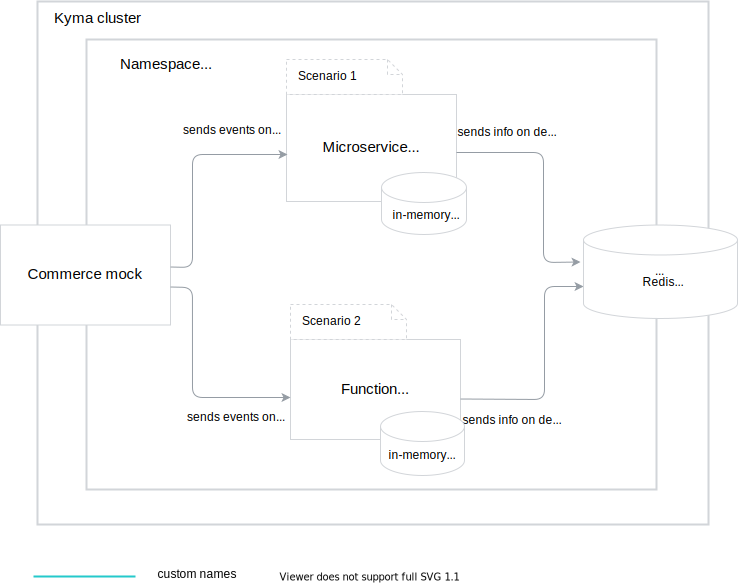

This set of Getting Started guides is an end-to-end scenario that will walk you through major Kyma components. You will learn how to:
1. Set up quickly local kubernetes cluster with Kyma (or install Kyma on existing cluster).
2. Deploy function (your code) to the cluster
3. Deploy a microservice (any docker container) to the cluster
3. Expose your workload (function/microservice) through API micro gateway
4. Trigger your workload with the event
5. Access your workload metrics

All guides, whenever possible, demonstrate the steps in both kubectl and Console UI.

## Prerequisites

- [kubectl](https://kubernetes.io/docs/tasks/tools/install-kubectl/) (1.16 or greater)
- [curl](https://github.com/curl/curl)

