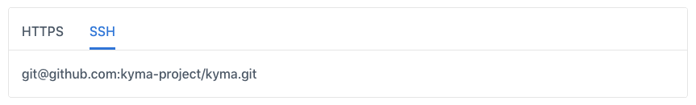

The DocsTopic or ClusterDocsTopic custom resource supports various documentation formats, including Markdown (`.md`) documents. Each `.md` file must consist of two parts: metadata and content. The following example illustrates the required structure: 

```
---
metadata: {value or text string}
another_metadata: {value or text string}
---

{The content of your document in **Markdown**.}
```

## Metadata

Each Markdown document displayed in the Kyma Console requires metadata in a specific format called [Front Matter](https://forestry.io/docs/editing/front-matter/). 

### Structure

When you create a Markdown document, define its `title` and `type`. Place the metadata at the top of your `.md` file, and separate it with three dashes.

```
---
title: {Document title}
type: {Document type}
---
```

- The `title` metadata defines the title of your document. 
- The `type` metadata groups single documents together. Multiple documents that use the same `type` generate a grouping. For example, if you have multiple tutorials, you can group them under a navigation node called **Tutorials**.

>**NOTE:** If there is only one document of a certain type, remove the `type` metadata, so that the document displays well in the UI.

### Display

In the Documentation view (Docs UI), that is available in the Console UI under the question mark icon on the top navigation panel, the metadata allow you to create the left-side navigation structure. The Docs UI displays documents grouped under a common `type` in alphanumeric order as per files names. The following example shows four documents, their metadata, and corresponding places in the left-side navigation:

<div tabs>
  <details>
  <summary>
  Metadata source
  </summary>

```
//03-01-sidecar-proxy-injection.md
---
title: Sidecar Proxy Injection
type: Details
---
``` 
```
//03-02-istio-patch.md
---
title: Istio Patch
type: Details
---
```
```
//03-03-istio-rbac.md
---
title: Istio RBAC configuration
type: Details
---
```
```
//01-01-service-mesh.md
---
title: Overview
---
```
  </details>
  <details>
  <summary>
  Docs UI preview
  </summary>


  </details>
</div>

In the Service Catalog and Instances views, which contain Service Classes documentation, the `title` metadata displays as the name of a particular tab. If you don't provide `title`, these UIs display the file name as a fallback. See the following example:

<div tabs>
  <details>
  <summary>
  Metadata source
  </summary>

```
//overview.md
---
title: Overview
---
``` 
```
//plan-details.md
---
title: Services and Plans
type: Details
---
```
  </details>
  <details>
  <summary>
  Service Catalog UI preview
  </summary>


  </details>
</div>

>**NOTE:** A document with the **Overview** `title` always displays as the first tab. Markdown files with `title` other than **Overview** appear in alphanumeric order.

## Content

Content is the body of your document. Write content in [Markdown](https://daringfireball.net/projects/markdown/syntax) which is a simplified markup language.

In Kyma, to make documentation more reader-friendly, some Markdown features are customized. See the following examples:

1. [Linking](https://github.com/kyma-project/community/blob/master/guidelines/content-guidelines/links-in-docs.md) - link between documents in the same topic or in different topics using metadata.

    <div tabs>
      <details>
      <summary>
      Source
      </summary>

    Create a reference using the /{type-of-topic}/{id}#{type}-{title}-{header} pattern:
    ```
    [Kyma in a nutshell](/root/kyma/#overview-in-a-nutshell)
    ```
      </details>
      <details>
      <summary>
      Preview
      </summary>

      [Kyma in a nutshell](/root/kyma/#overview-kyma-in-a-nutshell)
      </details>
    </div>

2. [Documentation toggles](https://github.com/kyma-project/community/blob/master/guidelines/content-guidelines/documentation-toggle.md) - render several versions of a given section in one document or have several versions of one document.

    <div tabs>
      <details>
      <summary>
      Source
      </summary>

    
      </details>
      <details>
      <summary>
      Preview
      </summary>

    
      </details>
    </div>
    
3. [Panels](https://github.com/kyma-project/community/blob/master/guidelines/content-guidelines/formatting.md#panels) - use colorful containers that call out important or additional information within a topic.

    <div tabs>
      <details>
      <summary>
      Source
      </summary>

    ```
    >**TIP:** If you contribute to the [bundles](https://github.com/kyma-project/bundles/tree/master/bundles) repository, you do not have to compress your bundles as the system does it automatically.
    ```
      </details>
      <details>
      <summary>
      Preview
      </summary>

    
      </details>
    </div>

Read the [Content Guidelines](https://github.com/kyma-project/community/tree/master/guidelines/content-guidelines) to learn more about the customized Markdown features and other rules of writing content in Kyma. 

>**CAUTION:** Markdown customized in a different way than in Kyma may not render properly in the Console UI.